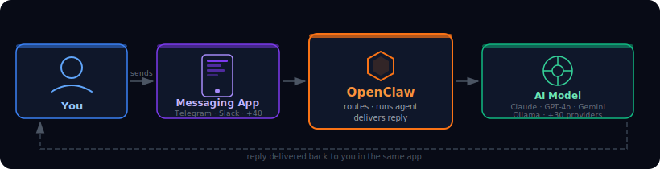
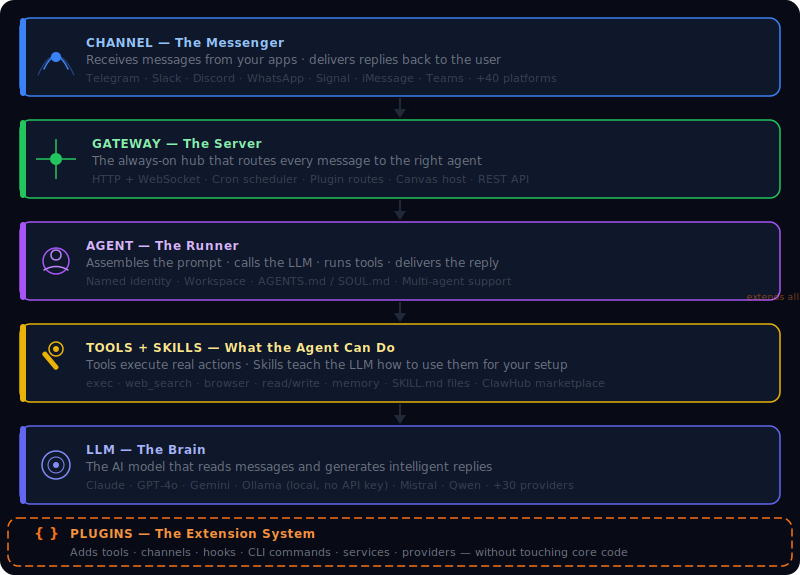
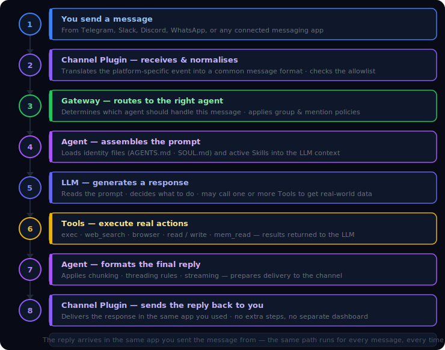

# 01 — OpenClaw Overview

## Contents

1. [What is OpenClaw?](#1-what-is-openclaw)
2. [The Six Building Blocks](#2-the-six-building-blocks)
   - 2.1 [LLM — The Brain](#21-llm--the-brain)
   - 2.2 [Agent — The Runner](#22-agent--the-runner)
   - 2.3 [Channel — The Messenger](#23-channel--the-messenger)
   - 2.4 [Tools & Skills — What the Agent Can Do](#24-tools--skills--what-the-agent-can-do)
   - 2.5 [Gateway — The Server](#25-gateway--the-server)
   - 2.6 [Plugins — The Extension System](#26-plugins--the-extension-system)
3. [How Everything Works Together](#3-how-everything-works-together)
4. [How to Install](#4-how-to-install)
5. [The Setup Journey](#5-the-setup-journey)
6. [Research Index](#6-research-index)

---

## 1. What is OpenClaw?



OpenClaw is a **personal AI assistant you run on your own device**. It connects AI models (Claude, GPT, Gemini, Ollama, and 30+ others) to the messaging apps you already use every day — Telegram, WhatsApp, Slack, Discord, Signal, iMessage, and 40+ more.

You install it once, configure it to your liking, and it runs quietly in the background. Send it a message from your phone, laptop, or any app you use — it reads your message, thinks it through using an AI model of your choice, and replies back in the same app.

| What it is | What it is not |
|---|---|
| A personal assistant you control | A cloud service run by someone else |
| Runs on your own PC, Mac, or server | Locked to a single AI provider |
| Works inside apps you already use | A separate app you have to open |
| Connects to any AI model you choose | Requires a subscription to a platform |
| Open source and self-hosted | Stores your data on someone else's machine |

---

## 2. The Six Building Blocks



OpenClaw is built from six concepts that work together. Understanding these is everything you need to start customizing.

---

### 2.1 LLM — The Brain

An **LLM** (Large Language Model) is the AI service that reads your message and writes a reply. Think of it as the thinking part — the intelligence behind the assistant.

OpenClaw supports **30+ LLM providers**: Claude, GPT, Gemini, Mistral, Qwen, and more — including local models via Ollama that run entirely on your own machine with no API key needed.

You configure which LLM to use. OpenClaw connects to it, sends your message, and brings back the reply. You can switch providers at any time, or set a backup that activates if your primary provider is unavailable.

> **Deep dive:** [02_LLM.md](02_LLM.md) · [02.1_LiteLLM.md](02.1_LiteLLM.md)

---

### 2.2 Agent — The Runner

An **Agent** is the layer that sits between you and the LLM. It receives your message, decides what to do, calls the LLM, and uses tools if needed — web search, file access, code execution, or sending messages to other platforms.

Think of the LLM as the brain, and the Agent as the person with that brain — it has a name, a job, a workspace folder, and a set of skills. The Agent is what makes the assistant feel personal and useful rather than just a chat window.

One agent handles all your requests by default. You can also run multiple agents for different purposes — work, personal, research — each with its own LLM and tools.

> **Deep dive:** [03_AGENTS.md](03_AGENTS.md)

---

### 2.3 Channel — The Messenger

A **Channel** is a messaging platform integration. Telegram, WhatsApp, Slack, Discord — each one is a plugin that connects OpenClaw to that platform's API. When you send a message from Telegram, the Telegram channel plugin receives it and passes it to your Agent. When the Agent replies, the same plugin sends it back to you in Telegram.

You do not need to use a special app. Just message your existing Telegram group, Slack workspace, or Discord server — OpenClaw is listening and will reply.

| Channel type | Examples |
|---|---|
| Mobile messaging | Telegram, WhatsApp, Signal, iMessage |
| Team chat | Slack, Discord, Microsoft Teams, Mattermost |
| Regional platforms | LINE, Zalo, Feishu, Google Chat |
| Developer / other | IRC, Matrix, Nostr, Twitch |

> **Deep dive:** [04_CHANNELS.md](04_CHANNELS.md) · [04.1_Slack_Channels.md](04.1_Slack_Channels.md) · [04.2_Team_Channels.md](04.2_Team_Channels.md)

---

### 2.4 Tools & Skills — What the Agent Can Do

**Tools** are callable functions that give the agent real-world capabilities beyond just generating text. Without tools, the agent can only produce words. With tools, it can run shell commands, read and write files, search the web, control a browser, send messages, and more.

**Skills** are plain-text instruction files (`SKILL.md`) that teach the LLM *how* and *when* to use those tools for your specific setup. A skill is loaded into the LLM's context before each conversation.

| | Tools | Skills |
|---|---|---|
| What it is | Executable functions | Instruction files for the LLM |
| Role | The "doing" layer | The "teaching" layer |
| Examples | `exec`, `web_search`, `browser`, `read` | `send-email`, `code-review`, `daily-standup` |

Tools are organized into groups (`group:runtime`, `group:fs`, `group:web`, etc.) and enabled via profiles in config. Skills live in your workspace's `skills/` folder and are picked up automatically.

Community skills are published and installable via **ClawHub** (`clawhub install <slug>`).

> **Deep dive:** [05_ToolsAndSkills.md](05_ToolsAndSkills.md) · [05.1_SetupGoogleCloud.md](05.1_SetupGoogleCloud.md)

---

### 2.5 Gateway — The Server

The **Gateway** is the always-on HTTP + WebSocket server that sits at the centre of OpenClaw. It is what starts when you run `openclaw gateway start`, and everything else connects to it — channels, agents, mobile clients, the CLI, and remote tools.

The gateway handles:
- Receiving inbound messages from all channels
- Routing them to the correct agent
- Streaming responses back to the client
- Running the cron scheduler
- Serving the Canvas UI for mobile nodes
- Exposing the REST/WebSocket API for connected clients

Think of it as the hub: channels, agents, tools, and UIs are all spokes that connect to this centre point.

> **Deep dive:** [06_Gateway.md](06_Gateway.md) · [06.1_Gateway.md](06.1_Gateway.md) · [06.2_Gateway_Study_Progress.md](06.2_Gateway_Study_Progress.md)

---

### 2.6 Plugins — The Extension System

A **Plugin** is a TypeScript/JavaScript module that extends OpenClaw without touching its core code. You place it in an `extensions/` folder (or install it via npm) and it is loaded automatically at startup.

A single plugin can register any combination of:
- New agent **tools**
- Lifecycle **hooks** (run code before/after LLM calls, tool calls, sessions, etc.)
- New **channels** (messaging platform integrations)
- **HTTP routes** on the gateway
- **CLI subcommands**
- Background **services**
- LLM **providers**
- Slash **commands** (bypasses the LLM entirely)

OpenClaw ships with 40+ bundled plugins in `extensions/` — including all channel integrations (Telegram, Discord, Slack, etc.), memory backends, voice call support, and more. You can write your own following the same contract.

> **Deep dive:** [05_ToolsAndSkills.md — Plugin section](05_ToolsAndSkills.md)

---

## 3. How Everything Works Together



---

## 4. How to Install

**Requirement:** Node.js version 22 or newer.

**Step 1 — Install OpenClaw:**

```bash
npm install -g openclaw@latest
# or with pnpm:
pnpm add -g openclaw@latest
```

**Step 2 — Run the setup wizard:**

```bash
openclaw onboard --install-daemon
```

The wizard walks you through connecting an LLM, creating an Agent, and optionally setting up a messaging channel. The `--install-daemon` flag makes OpenClaw start automatically in the background whenever your computer is on.

| Platform | Support |
|---|---|
| macOS | Fully supported |
| Linux | Fully supported |
| Windows | Use WSL2 (strongly recommended) |

---

## 5. The Setup Journey

After the initial install, you configure these in order:

| Step | What you do | Where to read |
|---|---|---|
| **1 — Install** | Install OpenClaw and run the onboarding wizard | This document |
| **2 — Add LLM** | Connect at least one AI model (API key or local Ollama) | [02_LLM.md](02_LLM.md) |
| **3 — Add Agent** | Create an agent with a name, workspace, and tools | [03_AGENTS.md](03_AGENTS.md) |
| **4 — Connect Channel** | Link a messaging app (Telegram, Slack, Discord, etc.) | [04_CHANNELS.md](04_CHANNELS.md) |
| **5 — Add Skills** | Teach the agent how to use tools for your setup | [05_ToolsAndSkills.md](05_ToolsAndSkills.md) |
| **6 — Start Gateway** | Start the server that runs everything | [06_Gateway.md](06_Gateway.md) |

Once all steps are done, OpenClaw runs in the background and responds to your messages automatically. You do not need to repeat these steps unless you want to add something new.

---

## 6. Research Index

All research documents produced so far. Start with this file, then follow links as needed.

### Core Concepts

| File | What it covers |
|---|---|
| [01_OVERALL.md](01_OVERALL.md) | This file — architecture overview, building blocks, setup journey |
| [02_LLM.md](02_LLM.md) | LLM providers — Claude, GPT, Gemini, Ollama, auth, fallbacks, model selection |
| [02.1_LiteLLM.md](02.1_LiteLLM.md) | LiteLLM integration — self-hosted proxy for unified model access |
| [03_AGENTS.md](03_AGENTS.md) | Agent types, configuration, identity files (AGENTS.md / SOUL.md), multi-agent |
| [04_CHANNELS.md](04_CHANNELS.md) | Channel concepts — allowlists, accounts, auth, threading, normalization, actions |
| [04.1_Slack_Channels.md](04.1_Slack_Channels.md) | Slack-specific channel setup and configuration |
| [04.2_Team_Channels.md](04.2_Team_Channels.md) | Team/work channel platforms (Slack, Teams, Mattermost, etc.) |
| [05_ToolsAndSkills.md](05_ToolsAndSkills.md) | Tools (exec, web_search, browser, fs, memory), Skills, ClawHub marketplace, Plugins |
| [05.1_SetupGoogleCloud.md](05.1_SetupGoogleCloud.md) | Google Cloud / Gemini provider setup |
| [06_Gateway.md](06_Gateway.md) | Gateway architecture — HTTP/WebSocket server, routing, auth, canvas, cron |
| [06.1_Gateway.md](06.1_Gateway.md) | Gateway deep-dive part 2 |
| [06.2_Gateway_Study_Progress.md](06.2_Gateway_Study_Progress.md) | Gateway study notes and progress tracking |

### UI

| File | What it covers |
|---|---|
| *(06_UI.md)* | CLI, Canvas, A2UI bridge, Session Export HTML, Gateway as backend |

### User Guides

Step-by-step practical guides for using specific parts of the system.

| File | What it covers |
|---|---|
| [UserGuide/01_CLI.md](UserGuide/01_CLI.md) | Full CLI reference — all command groups from basic setup to advanced infra, with examples |
