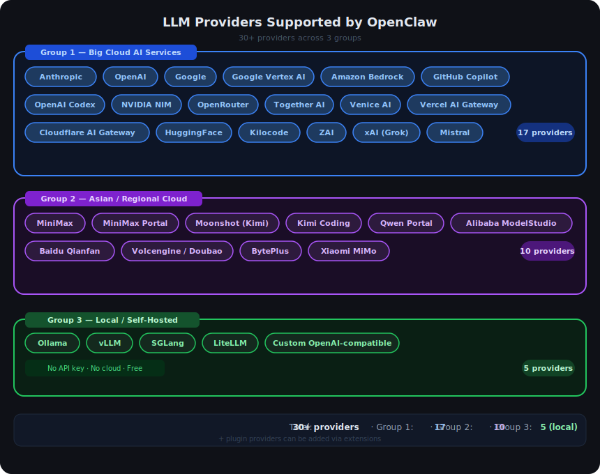
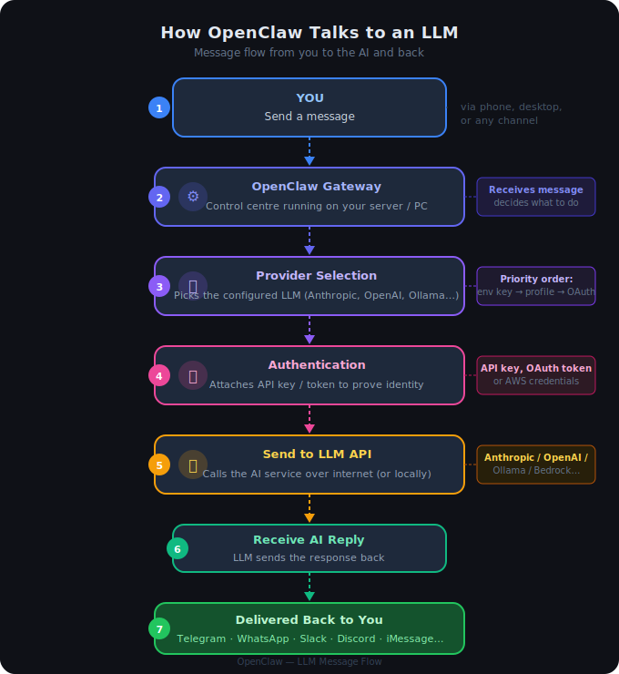
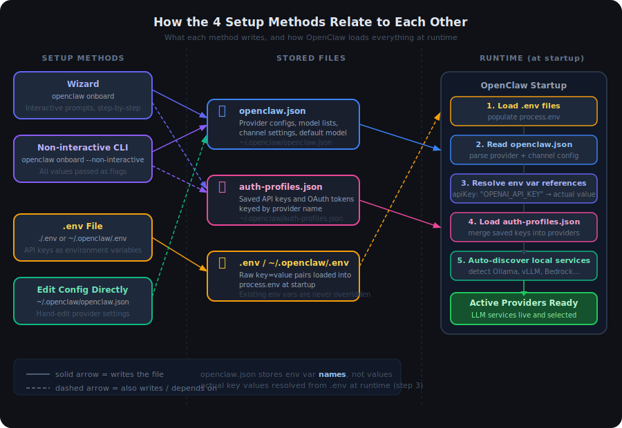
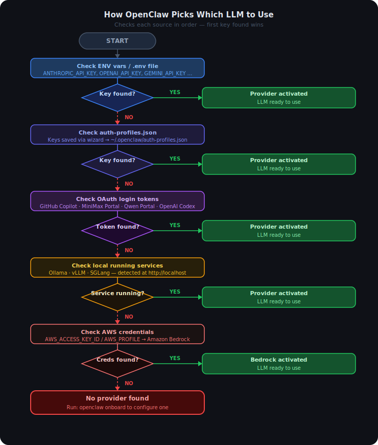
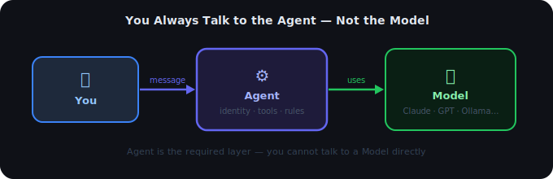

# 02 — LLM Services in OpenClaw

## Contents

1. [What is an LLM?](#1-what-is-an-llm)
2. [How Many LLM Services Does OpenClaw Support?](#2-how-many-llm-services-does-openclaw-support)
3. [How Does OpenClaw Connect to an LLM?](#3-how-does-openclaw-connect-to-an-llm)
4. [How Many Ways Can You Set Up an LLM?](#4-how-many-ways-can-you-set-up-an-llm)
   - 4.1 [How They Relate to Each Other](#41-how-they-relate-to-each-other)
5. [Setup Flows (Step by Step)](#5-setup-flows-step-by-step)
   - 5.1 [Way 1 — Wizard (Recommended for Beginners)](#51-way-1--wizard-recommended-for-beginners)
   - 5.2 [Way 2 — Environment Variables / .env File](#52-way-2--environment-variables--env-file)
   - 5.3 [Way 3 — Non-Interactive CLI](#53-way-3--non-interactive-cli-for-automation--servers)
   - 5.4 [Way 4 — Edit Config File Directly](#54-way-4--edit-config-file-directly-advanced)
6. [How OpenClaw Picks Which LLM to Use](#6-how-openclaw-picks-which-llm-to-use)
7. [Agent and Model — How They Work Together](#7-agent-and-model--how-they-work-together)
8. [How to Test Whether Your LLM Config Works](#8-how-to-test-whether-your-llm-config-works)

---

## 1. What is an LLM?

An **LLM** (Large Language Model) is the "brain" behind the AI assistant — the service that reads your message and writes a reply. Think of it like choosing which smart assistant to talk to: ChatGPT, Claude, Gemini, etc. OpenClaw lets you plug in many different brains and even switch between them.

---

## 2. How Many LLM Services Does OpenClaw Support?

OpenClaw supports **30+ LLM providers** across three groups: **Group 1** — major cloud services that need an API key (Anthropic, OpenAI, Google, Amazon Bedrock, GitHub Copilot, OpenRouter, and more); **Group 2** — Asian/regional services (MiniMax, Moonshot/Kimi, Alibaba, Baidu, ByteDance, Xiaomi, and more); **Group 3** — local/self-hosted with no API key needed (Ollama, vLLM, SGLang, LiteLLM).



---

## 3. How Does OpenClaw Connect to an LLM?

Here is the journey from your message to the AI's reply, in plain words:



| Step | What happens |
|---|---|
| 1 — You | Send a message via any channel (Telegram, WhatsApp, Slack…) |
| 2 — Gateway | OpenClaw receives the message on your server/PC |
| 3 — Provider Selection | Picks the LLM you configured (or the highest-priority available one) |
| 4 — Authentication | Attaches your API key, OAuth token, or AWS credentials |
| 5 — Send to LLM API | Calls the AI service over the internet — or a local Ollama server |
| 6 — Receive Reply | The AI's response comes back to the Gateway |
| 7 — Deliver to You | Reply is sent back through the original channel |


---

## 4. How Many Ways Can You Set Up an LLM?

There are **4 ways** to connect an LLM to OpenClaw:

| # | Method | Best for |
|---|---|---|
| **1** | Wizard (interactive) | First-time setup — guided step by step |
| **2** | Environment variables / `.env` file | Quick setup, scripts, Docker |
| **3** | Non-interactive CLI flags | Automation, CI/CD, server provisioning |
| **4** | Edit config file directly | Advanced users, fine-tuning settings |

### 4.1 How They Relate to Each Other



The key things to understand:

- **Wizard** and **Non-interactive CLI** both do the same thing — they write to two files: `openclaw.json` (provider settings) and `auth-profiles.json` (your saved API keys). The only difference is wizard asks you questions, CLI takes flags.
- **`.env` file** works completely independently — you just put your API key there and OpenClaw finds it automatically at startup. No config file editing needed.
- **Edit config directly** is just writing to `openclaw.json` by hand — the same file the wizard writes.
- At runtime, OpenClaw **merges all three sources** in order: `.env` first, then `openclaw.json`, then `auth-profiles.json`. The `openclaw.json` file stores env var *names* (e.g. `OPENAI_API_KEY`), not actual key values — the real value is resolved from the environment at startup.

---

## 5. Setup Flows (Step by Step)

### 5.1 Way 1 — Wizard (Recommended for Beginners)

The easiest path. The wizard asks you questions and writes all the config for you.

```
Step 1: Run the wizard
        openclaw onboard

Step 2: Wizard asks — "Which AI service do you want to use?"
        (You pick from a list: Anthropic, OpenAI, Gemini, Ollama, etc.)

Step 3: Wizard asks — "Enter your API key"
        (You paste the key you got from the provider's website)

Step 4: Wizard saves the key securely in auth profiles
        (~/.openclaw/auth-profiles.json)

Step 5: Wizard writes the provider config to openclaw.json
        (sets baseUrl, model list, default model)

Step 6: Done — OpenClaw starts using the LLM immediately
```

**Supported auth choices you can pass directly to skip the menu:**

```bash
# Examples — pick one:
openclaw onboard --auth-choice anthropic          # Claude via Anthropic
openclaw onboard --auth-choice openai-api-key     # GPT via OpenAI
openclaw onboard --auth-choice gemini-api-key     # Gemini via Google
openclaw onboard --auth-choice github-copilot     # Copilot via GitHub
openclaw onboard --auth-choice ollama             # Local Ollama (no key)
openclaw onboard --auth-choice openrouter-api-key # OpenRouter (many models)
openclaw onboard --auth-choice litellm-api-key    # LiteLLM proxy
openclaw onboard --auth-choice custom-api-key     # Any OpenAI-compatible server
```

---

### 5.2 Way 2 — Environment Variables / `.env` File

No wizard needed. Just set the API key and OpenClaw finds it automatically on startup.

```
Step 1: Open (or create) a .env file in your OpenClaw folder

Step 2: Add your key:

        ANTHROPIC_API_KEY=sk-ant-...
        # — or —
        OPENAI_API_KEY=sk-...
        # — or —
        GEMINI_API_KEY=...
        # — or —
        OPENROUTER_API_KEY=sk-or-...

Step 3: Start OpenClaw
        openclaw gateway

Step 4: OpenClaw reads the .env, detects the key, and auto-activates
        the matching provider — no extra config needed
```

### 5.3 Way 3 — Non-Interactive CLI (for Automation / Servers)

Pass everything as flags — no prompts, no wizard. Useful for Docker, CI/CD, or scripting.

```
Step 1: Run onboard with --non-interactive and provide all values as flags

        openclaw onboard \
          --non-interactive \
          --auth-choice openai-api-key \
          --openai-api-key sk-...

Step 2: OpenClaw writes config and auth profiles automatically, then exits

Step 3: Start the gateway
        openclaw gateway
```

**Examples for common providers:**

```bash
# Anthropic
openclaw onboard --non-interactive --auth-choice apiKey --anthropic-api-key sk-ant-...

# OpenAI
openclaw onboard --non-interactive --auth-choice openai-api-key --openai-api-key sk-...

# Gemini
openclaw onboard --non-interactive --auth-choice gemini-api-key --gemini-api-key ...

# Ollama (no key needed)
openclaw onboard --non-interactive --auth-choice ollama

# Custom OpenAI-compatible server
openclaw onboard --non-interactive \
  --auth-choice custom-api-key \
  --custom-base-url http://my-server:8080/v1 \
  --custom-api-key my-key \
  --custom-model-id my-model-name

# vLLM local server
openclaw onboard --non-interactive --auth-choice vllm

# LiteLLM proxy
openclaw onboard --non-interactive \
  --auth-choice litellm-api-key \
  --litellm-api-key my-key
```

---

### 5.4 Way 4 — Edit Config File Directly (Advanced)

For power users who want full control. Edit `openclaw.json` (or `~/.openclaw/openclaw.json`) manually.

```
Step 1: Open ~/.openclaw/openclaw.json (created after first run)

Step 2: Add or edit the "models" section:

        {
          "models": {
            "mode": "merge",
            "providers": {
              "my-provider": {
                "baseUrl": "https://api.example.com/v1",
                "api": "openai-completions",
                "apiKey": "MY_API_KEY_ENV_VAR",
                "models": [
                  {
                    "id": "my-model",
                    "name": "My Model",
                    "reasoning": false,
                    "input": ["text", "image"],
                    "contextWindow": 128000,
                    "maxTokens": 8192,
                    "cost": { "input": 0, "output": 0, "cacheRead": 0, "cacheWrite": 0 }
                  }
                ]
              }
            },
            "defaults": {
              "model": {
                "primary": "my-provider/my-model"
              }
            }
          }
        }

Step 3: Set the API key in your environment or .env:
        MY_API_KEY_ENV_VAR=sk-...

Step 4: Restart OpenClaw — it reads the new config on startup
```

---

## 6. How OpenClaw Picks Which LLM to Use

When multiple providers are configured, OpenClaw checks in this order — first match wins:



If you have **multiple keys for the same provider**, OpenClaw can rotate between them automatically — if one key hits a rate limit or goes down, it falls over to the next one.

---

## 7. Agent and Model — How They Work Together

When you send a message, you are always talking to an **Agent** — not directly to a Model. The Agent sits in the middle: it receives your message, applies its identity, tools, and behavior rules, then calls the Model on your behalf. You cannot skip the Agent and call the Model directly.

Setting up an Agent is the required next step after you configure a Model. Without an Agent, the Model is registered but nothing can use it.

- **Model** = the AI brain (Claude, GPT-4o, Ollama…) — processes text and generates replies
- **Agent** = the runner that uses the Model — adds identity, tools, skills, and behavior rules



### How They Are Set Up in openclaw.json

There are two separate sections inside `openclaw.json`:

| Section | What it does |
|---|---|
| `models` | Registers available AI services — URL, API key, list of model IDs |
| `agents` | Controls how the assistant runs — which model to use, persona, tools, workspace |

**`models` — registers the AI service:**

```json
"models": {
  "providers": {
    "anthropic": {
      "apiKey": "ANTHROPIC_API_KEY",
      "models": [{ "id": "claude-sonnet-4-5" }]
    }
  }
}
```

**`agents` — picks the model and sets behavior:**

```json
"agents": {
  "defaults": {
    "model": {
      "primary": "anthropic/claude-sonnet-4-5",
      "fallbacks": ["openai/gpt-4o"]
    },
    "thinkingDefault": "high"
  },
  "list": [
    {
      "id": "personal",
      "default": true,
      "model": { "primary": "anthropic/claude-sonnet-4-5" },
      "identity": { "name": "Aria" },
      "skills": ["web-search"],
      "workspace": "~/projects"
    }
  ]
}
```

### Key Rules

- An agent **must reference a model that exists** in the `models` section — using the format `"provider/model-id"`
- `agents.defaults` applies to **all agents** unless a specific agent overrides it
- Each agent in `agents.list` can have its **own model**, tools, workspace, and identity
- If you only have one agent, you only need `agents.defaults` — no need for `agents.list`

---

## 8. How to Test Whether Your LLM Config Works

### 8.1 Step 1 — Check what providers OpenClaw can see

```bash
openclaw models list
```

This lists every model OpenClaw detected from your configured providers. If your provider appears here, the key was found and accepted.

**What to look for:**
- Your provider name and model ID should be in the list
- If the list is empty or your provider is missing → key was not found (check Section 6 priority order)

---

### 8.2 Step 2 — Run a health check

```bash
openclaw doctor
```

This scans your entire setup — gateway, config files, auth profiles, and model availability — and reports any problems with fix hints.

**What to look for:**
- No red errors → config is healthy
- Any warning about "model not found" or "no provider" → go back to Section 5 and re-run setup

---

### 8.3 Step 3 — Send a real test message

```bash
openclaw agent --message "say hello"
```

This sends a message directly to the LLM from your terminal and prints the reply. It is the fastest way to confirm end-to-end that everything works.

**What to look for:**
- You get a reply → LLM is connected and working
- Error like "no model configured" → run `openclaw onboard`
- Error like "unauthorized" or "401" → API key is wrong or expired

---

### 8.4 Quick Reference

| Command | What it tells you |
|---|---|
| `openclaw models list` | Which providers and models are visible to OpenClaw |
| `openclaw doctor` | Full health check — config, auth, gateway, models |
| `openclaw agent --message "say hello"` | Live end-to-end test with the actual LLM |
