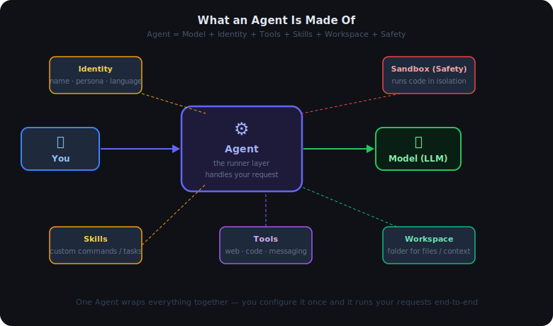
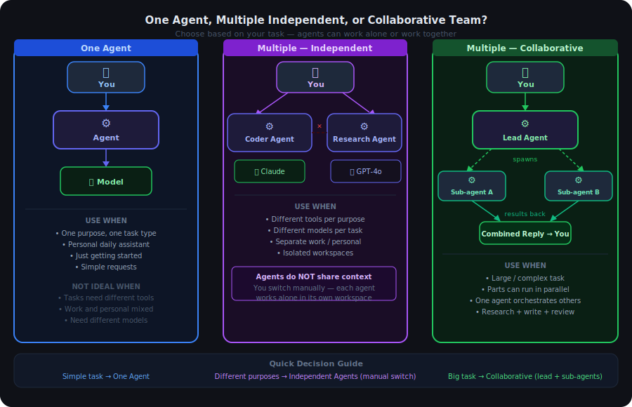
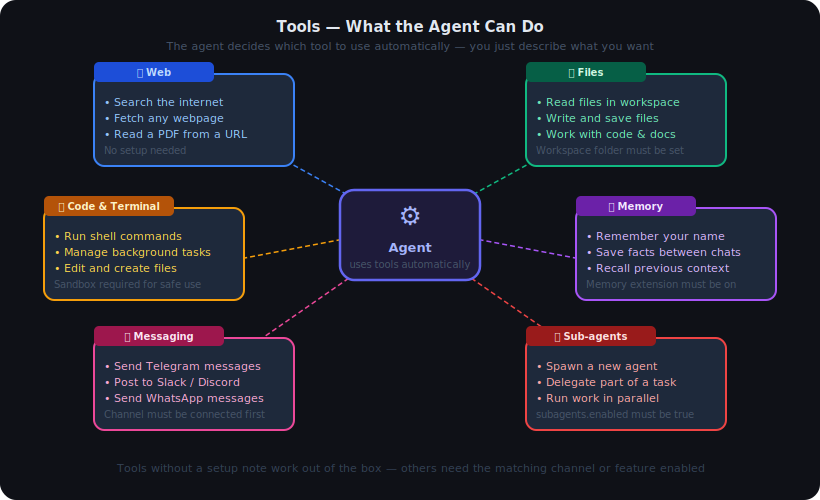
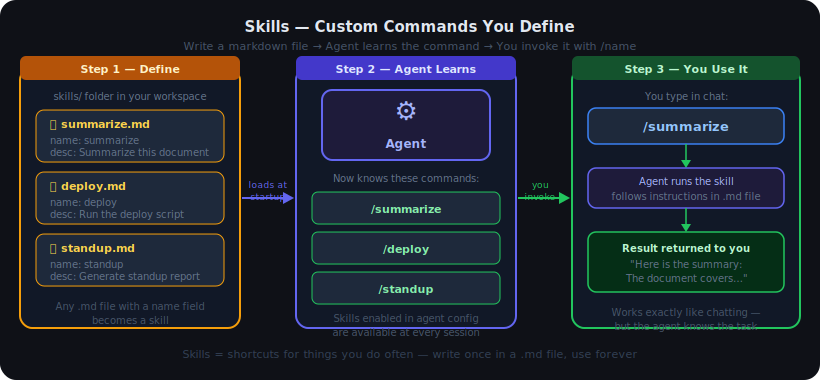
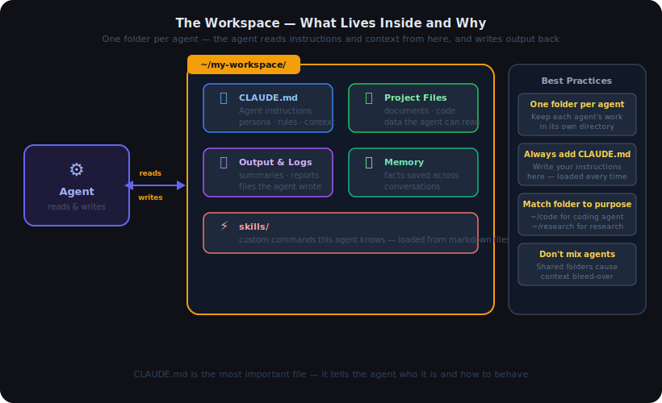
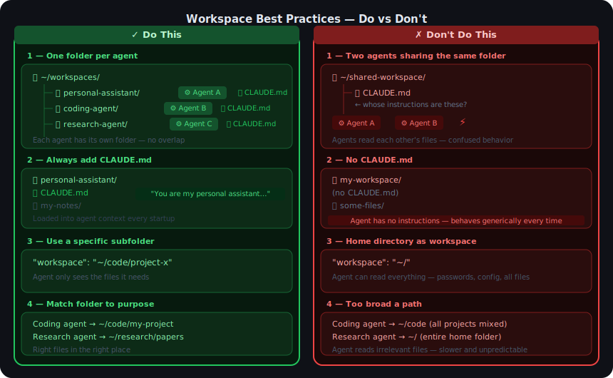
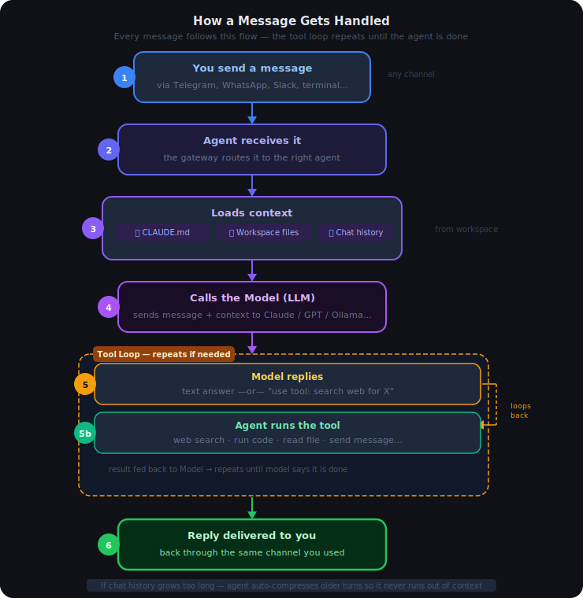

# 03 — Agents in OpenClaw

## Contents

1. [Overall About Agent](#1-overall-about-agent)
   - 1.1 [What is an Agent?](#11-what-is-an-agent)
   - 1.2 [Why Does the Agent Matter?](#12-why-does-the-agent-matter)
   - 1.3 [The Main Components](#13-the-main-components)
2. [How to Set Up Your First Agent](#2-how-to-set-up-your-first-agent)
   - 2.1 [Setup First Simple Agent](#21-setup-first-simple-agent)
   - 2.2 [Edit Config Directly](#22-edit-config-directly)
3. [One Agent or Multiple Agents?](#3-one-agent-or-multiple-agents)
   - 3.1 [One Agent](#31-one-agent)
   - 3.2 [Multiple Independent Agents](#32-multiple-independent-agents)
   - 3.3 [Multiple Collaborative Agents (Team Mode)](#33-multiple-collaborative-agents-team-mode)
   - 3.4 [Summary — Which Mode to Choose](#34-summary--which-mode-to-choose)
4. [What Can an Agent Do?](#4-what-can-an-agent-do)
   - 4.1 [Tools — Actions the Agent Can Take](#41-tools--actions-the-agent-can-take)
   - 4.2 [Skills — Custom Commands](#42-skills--custom-commands)
5. [Workspace — Where the Agent Works](#5-workspace--where-the-agent-works)
   - 5.1 [Why You Need a Workspace](#51-why-you-need-a-workspace)
   - 5.2 [What Lives Inside](#52-what-lives-inside)
   - 5.3 [Best Practices](#53-best-practices)
6. [How a Message Gets Handled](#6-how-a-message-gets-handled)
7. [How to Test If Your Agent Works](#7-how-to-test-if-your-agent-works)

---

## 1. Overall About Agent

### 1.1 What is an Agent?

An **Agent** is the layer that sits between you and the AI Model. When you send a message, the Agent receives it, decides what to do, calls the Model, uses tools if needed, and sends the reply back to you.

You never talk directly to a Model — you always go through an Agent. Think of the Model as the brain, and the Agent as the person who has that brain, a name, a job, and a set of tools to work with.

---

### 1.2 Why Does the Agent Matter?

A raw Model can only answer text. An Agent turns it into a full assistant:

| Without Agent | With Agent |
|---|---|
| Can only reply to text | Can search the web, run code, send messages |
| No name or personality | Has an identity — name, language, behavior rules |
| No memory of your files | Has a workspace folder to read and write files |
| Single model, no failover | Can switch to a backup model if the primary fails |
| No custom commands | Has skills — commands you define for specific tasks |

---

### 1.3 The Main Components



| Component | What it does |
|---|---|
| **Model** | The AI brain — Claude, GPT, Ollama, etc. Agent calls this to generate replies |
| **Identity** | Name, persona, and language style of the agent |
| **Tools** | Actions the agent can take — web search, run code, send Telegram/Slack messages |
| **Skills** | Custom slash commands you define (e.g. `/summarize`, `/deploy`) |
| **Workspace** | A folder on disk the agent uses to read and write files |
| **Sandbox** | A safety container — runs code in isolation so it cannot affect your system |

---

## 2. How to Set Up Your First Agent

Before you start, make sure at least one Model is configured (see `02_LLM.md`). There are three ways to add an agent — pick the one that fits how you work.

---

### 2.1 Setup First Simple Agent

The easiest way is the interactive wizard. Run this command and answer the prompts:

```bash
openclaw agents add
```

The wizard walks you through each step one at a time:

```
? Agent name:        › personal
? Workspace folder:  › ~/my-workspace
? Primary model:     › anthropic/claude-sonnet-4-5
? Connect a channel? › Telegram
? Bind to channel?   › yes
```

When you finish, OpenClaw writes the agent to your `openclaw.json` automatically. You do not need to touch any config file.

**Good for:** first-time setup, when you are not sure what options to use.

---

### 2.2 Edit Config Directly

You can always open `openclaw.json` and write the agent by hand. This gives you full control over every option.

**Minimum — one agent, one model:**

```json
"agents": {
  "defaults": {
    "model": {
      "primary": "anthropic/claude-sonnet-4-5"
    }
  }
}
```

OpenClaw creates a default agent automatically from this — no `list` entry needed.

**Full example — named agent with workspace and skills:**

```json
"agents": {
  "list": [
    {
      "id": "personal",
      "default": true,
      "model": { "primary": "anthropic/claude-sonnet-4-5" },
      "identity": { "name": "Aria" },
      "workspace": "~/my-workspace",
      "skills": ["web-search", "summarize"]
    }
  ]
}
```

| Field | Required? | What it sets |
|---|---|---|
| `id` | Yes | Unique name for this agent |
| `default` | Recommended | Marks this as the agent used when no agent is specified |
| `model.primary` | Yes | Which LLM to use — format `"provider/model-id"` |
| `identity.name` | No | The display name of the assistant |
| `workspace` | No | Folder the agent works in (reads/writes files here) |
| `skills` | No | List of skill names to enable |

> **Tip:** Use `agents.defaults` to set options that apply to every agent — for example a shared model or sandbox settings. Individual agents in `list` will inherit these and can override only what they need.

**Good for:** advanced users, managing many agents, settings the wizard does not expose.

---

## 3. One Agent or Multiple Agents?

There are three ways to run agents in OpenClaw. Choosing the right one depends on what you are trying to do.



---

### 3.1 One Agent

The simplest setup. One agent handles all your requests, using one model.

**Good for:** personal daily assistant, simple tasks, getting started.

```json
"agents": {
  "defaults": {
    "model": { "primary": "anthropic/claude-sonnet-4-5" }
  }
}
```

---

### 3.2 Multiple Independent Agents

You configure several agents — each with its own model, tools, and workspace. They **do not know about each other**. You choose which agent to talk to each time, and each one works entirely on its own.

**Good for:** separating work from personal, using different models for different tasks, keeping workspaces isolated.

```json
"agents": {
  "list": [
    {
      "id": "coder",
      "model": { "primary": "anthropic/claude-opus-4-6" },
      "workspace": "~/code",
      "skills": ["exec"]
    },
    {
      "id": "researcher",
      "default": true,
      "model": { "primary": "openai/gpt-4o" },
      "workspace": "~/research",
      "skills": ["web-search"]
    }
  ]
}
```

To switch between agents: `openclaw agent --agent coder --message "fix the build"`

> **Important:** Independent agents cannot see each other's conversations, files, or memory. They are completely separate. If you want them to share work, you need the collaborative mode below.

---

### 3.3 Multiple Collaborative Agents (Team Mode)

One **lead agent** receives your request and breaks it into parts. It then **spawns sub-agents** to handle each part in parallel, collects their results, and sends you the combined answer.

**Good for:** large or complex tasks, work that benefits from parallel execution, pipelines like "research → write → review."

Example flow:

```
You: "Research AI trends, write a report, then proofread it"
        │
        ▼
   Lead Agent
        │
   ┌────┴────┐
   ▼         ▼
Research   Writer     ← sub-agents run in parallel
 Agent      Agent
   │         │
   └────┬────┘
        ▼
  Lead Agent combines results
        │
        ▼
   Final report → You
```

Sub-agents are spawned automatically by the lead agent using the `subagents` tool — you do not configure them separately. You only need to enable sub-agent support in the lead agent's config:

```json
{
  "id": "lead",
  "default": true,
  "model": { "primary": "anthropic/claude-opus-4-6" },
  "subagents": { "enabled": true }
}
```

---

### 3.4 Summary — Which Mode to Choose

| Situation | Use |
|---|---|
| One purpose, simple tasks | **One Agent** |
| Different tasks needing different tools or models | **Independent Agents** — switch manually |
| Work and personal life separated | **Independent Agents** — isolated workspaces |
| Large task that can be split into parts | **Collaborative Agents** — lead spawns sub-agents |
| Research + writing + review pipeline | **Collaborative Agents** — run in parallel |

---

## 4. What Can an Agent Do?

### 4.1 Tools — Actions the Agent Can Take

Tools are built-in abilities the agent can use automatically when your request needs them. You do not call tools yourself — the agent decides when to use them.



| Category | What it can do | Needs setup? |
|---|---|---|
| **Web** | Search the internet, fetch a webpage, read a PDF | No |
| **Code** | Run shell commands, manage background processes | Sandbox recommended |
| **Messaging** | Send Telegram, WhatsApp, Slack, Discord messages | Channel must be connected |
| **Files** | Read and write files in the workspace | Workspace folder must be set |
| **Memory** | Remember facts across conversations | Memory extension must be on |
| **Sub-agents** | Spawn another agent to handle part of a task | `subagents.enabled: true` |

Tools are enabled per-agent in the config. If a tool is not listed for an agent, the agent cannot use it.

---

### 4.2 Skills — Custom Commands

Skills are custom commands you or the community define. They appear as `/command` shortcuts the agent knows how to run.



The flow is simple:
1. **Define** — create a `.md` file in your `skills/` folder with a `name` and a description of what it should do
2. **Load** — the agent reads all skill files when it starts up and learns the commands
3. **Use** — type `/skillname` in chat and the agent runs it

To enable a skill for an agent, add it to the `skills` list in the agent config:

```json
{
  "id": "personal",
  "skills": ["summarize", "standup", "deploy"]
}
```

Skills work exactly like chatting — you just get a consistent, repeatable result every time because the agent already knows exactly what to do.

---

## 5. Workspace — Where the Agent Works

### 5.1 Why You Need a Workspace

A workspace is simply a **folder on your computer** that belongs to one agent. Without a workspace, the agent has no place to read your files, remember past work, or write output — every conversation starts completely blank.

With a workspace, the agent can:
- Read documents or code you put in the folder and refer to them in replies
- Write reports, summaries, or generated files back to the folder
- Load your custom instructions from `CLAUDE.md` every time it starts
- Remember facts across multiple conversations (memory)

Think of it like giving the assistant a desk with a drawer — everything it needs is there, and anything it produces goes back there.

---

### 5.2 What Lives Inside



| File / Folder | What it is | Required? |
|---|---|---|
| `CLAUDE.md` | Instructions for the agent — who it is, how to behave, what to focus on | Strongly recommended |
| Project files | Any documents, code, or data you want the agent to be able to read | Optional |
| Output & logs | Files the agent creates — summaries, reports, generated code | Written automatically |
| Memory | Facts the agent saves to remember across conversations | Written automatically |
| `skills/` | Markdown files defining custom commands for this agent | Optional |

**The most important file is `CLAUDE.md`.** It is loaded into the agent's context at every startup. If you want the agent to know your name, your project's purpose, or a specific way of working — write it there.

Example `CLAUDE.md`:

```markdown
You are my personal research assistant.
My name is Alex. Always reply in English.
Focus on the topic of renewable energy.
When summarizing, use bullet points.
```

---

### 5.3 Best Practices



| Rule | Why it matters |
|---|---|
| **One folder per agent** | If two agents share a folder they read each other's files — confused behavior |
| **Always add `CLAUDE.md`** | Without it the agent has no instructions and behaves generically every time |
| **Use a specific subfolder** | `~/` gives access to your entire home — passwords, configs, everything |
| **Match the folder to the work** | Coding agent → `~/code/project`, research agent → `~/research/papers` |

---

## 6. How a Message Gets Handled

When you send a message, the agent follows this flow every time:



---

## 7. How to Test If Your Agent Works

**Step 1 — Send a direct test message:**

```bash
openclaw agent --message "say hello"
```

You should get a reply. If you do, the agent and model are working end-to-end.

**Step 2 — Run a full health check:**

```bash
openclaw doctor
```

This checks the gateway, config files, API keys, and model availability — and shows fix hints for any problem found.

**Step 3 — List configured agents:**

```bash
openclaw agents list
```

This shows every agent OpenClaw knows about, which model each uses, and whether a default is set.

| What you see | What it means |
|---|---|
| Reply to "say hello" | Agent + model working correctly |
| "no agent configured" error | No agent in `openclaw.json` — add one (see Section 2) |
| "no model configured" error | Model not set up — see `02_LLM.md` |
| "unauthorized" / 401 error | API key wrong or expired |
