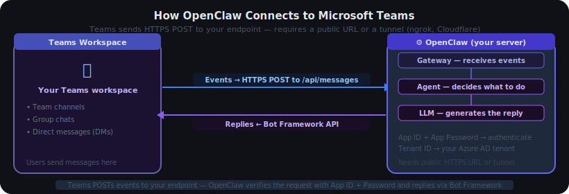
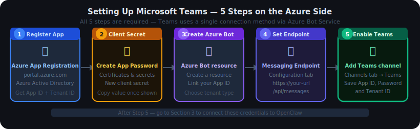

# 04.2 — Microsoft Teams Channel Setup

## Contents

1. [How Teams Connects to OpenClaw](#1-how-teams-connects-to-openclaw)
2. [Set Up Teams — The Azure Side](#2-set-up-teams--the-azure-side)
   - 2.1 [Register Your App in Azure AD](#21-register-your-app-in-azure-ad)
   - 2.2 [Create a Client Secret](#22-create-a-client-secret)
   - 2.3 [Create an Azure Bot Resource](#23-create-an-azure-bot-resource)
   - 2.4 [Set Your Messaging Endpoint](#24-set-your-messaging-endpoint)
   - 2.5 [Enable the Teams Channel and Copy Credentials](#25-enable-the-teams-channel-and-copy-credentials)
3. [Set Up OpenClaw — The OpenClaw Side](#3-set-up-openclaw--the-openclaw-side)
   - 3.1 [Way 1 — Wizard (Recommended)](#31-way-1--wizard-recommended)
   - 3.2 [Way 2 — Environment Variables](#32-way-2--environment-variables)
   - 3.3 [Way 3 — Config File Directly](#33-way-3--config-file-directly)
4. [Add the Bot to Your Teams Channels](#4-add-the-bot-to-your-teams-channels)
5. [Test](#5-test)

---

## 1. How Teams Connects to OpenClaw



Microsoft Teams uses the **Azure Bot Service** to deliver messages. Every message a user sends is POSTed by Microsoft to your endpoint as an HTTPS request. OpenClaw listens at `/api/messages` (or a custom path you configure) and replies back through the Bot Framework API.

| | Microsoft Teams |
|---|---|
| **How it works** | Microsoft POSTs events to your HTTPS endpoint |
| **Public URL?** | Yes — needs a publicly reachable HTTPS endpoint |
| **Credentials needed** | App ID, App Password, Tenant ID |
| **Default endpoint** | `/api/messages` (port `3978`) |
| **Best for** | Cloud server, production; or local with a tunnel |

Because Microsoft initiates the connection to your server, OpenClaw needs to be reachable over HTTPS. If you are running locally, use a tunneling tool like [ngrok](https://ngrok.com) or [Cloudflare Tunnel](https://developers.cloudflare.com/cloudflare-one/connections/connect-networks/) to get a public URL.

---

## 2. Set Up Teams — The Azure Side



### 2.1 Register Your App in Azure AD

1. Go to the [Azure Portal](https://portal.azure.com)
2. Search for **Azure Active Directory** and open it
3. Click **App registrations** → **New registration**
4. Enter a name (e.g. `OpenClaw`) and select the appropriate account type:
   - **Single tenant** — only users in your own organisation
   - **Multi-tenant** — users from any Microsoft organisation
5. Leave the Redirect URI blank for now
6. Click **Register**

After registration, copy these two values — you will need them later:

| Value | Where to find it |
|---|---|
| **Application (client) ID** | Overview page of the app registration |
| **Directory (tenant) ID** | Overview page of the app registration |

---

### 2.2 Create a Client Secret

The client secret is your **App Password** — it proves OpenClaw is allowed to act as this bot.

1. Still in your app registration, click **Certificates & secrets** in the left sidebar
2. Click **New client secret**
3. Enter a description (e.g. `openclaw`) and choose an expiry
4. Click **Add**
5. **Copy the secret Value immediately** — it is only shown once. This is your App Password.

> **Important:** Copy the **Value** column, not the Secret ID. Once you leave this page, the value is hidden.

---

### 2.3 Create an Azure Bot Resource

1. In the Azure Portal, click **Create a resource** and search for **Azure Bot**
2. Click **Create**
3. Fill in the details:
   - **Bot handle** — a unique name for your bot (e.g. `openclaw-bot`)
   - **Subscription** and **Resource group** — choose your existing ones
   - **Microsoft App ID** — select **Use existing app registration** and paste the App ID from Step 2.1
4. Click **Review + create** → **Create**

---

### 2.4 Set Your Messaging Endpoint

This tells Microsoft where to send messages. You need a public HTTPS URL first.

**If running locally**, start a tunnel and note the public HTTPS URL:

```bash
# Example with ngrok:
ngrok http 3978
# Copy the https://... URL it gives you
```

**Then set the endpoint:**

1. Open your Azure Bot resource
2. Click **Configuration** in the left sidebar
3. In the **Messaging endpoint** field, enter your URL followed by `/api/messages`:
   ```
   https://your-public-url.ngrok.io/api/messages
   ```
4. Click **Apply**

---

### 2.5 Enable the Teams Channel and Copy Credentials

1. In your Azure Bot resource, click **Channels** in the left sidebar
2. Click **Microsoft Teams**
3. Accept the terms of service and click **Agree**
4. Click **Apply** — the Teams channel is now active

You now have everything you need:

| Credential | Where to find it |
|---|---|
| **App ID** | App registration → Overview → Application (client) ID |
| **App Password** | The client secret value you copied in Step 2.2 |
| **Tenant ID** | App registration → Overview → Directory (tenant) ID |

Keep these private — anyone with these credentials can send messages as your bot.

---

## 3. Set Up OpenClaw — The OpenClaw Side

### 3.1 Way 1 — Wizard (Recommended)

```bash
openclaw channels add
```

Select **Microsoft Teams**, then follow the prompts. The wizard asks for your App ID, App Password, and Tenant ID, then configures everything automatically.

---

### 3.2 Way 2 — Environment Variables

Set the three variables, then start OpenClaw:

```bash
MSTEAMS_APP_ID=your-app-id
MSTEAMS_APP_PASSWORD=your-client-secret
MSTEAMS_TENANT_ID=your-tenant-id
```

Then:

```bash
openclaw gateway
```

OpenClaw detects the credentials automatically and starts listening at `/api/messages` on port `3978`.

---

### 3.3 Way 3 — Config File Directly

Edit `openclaw.json` and add the `msteams` section. Use the variable name (not the raw value) — OpenClaw resolves it from your environment at startup.

**Minimal config:**

```json
"channels": {
  "msteams": {
    "enabled": true,
    "appId": "MSTEAMS_APP_ID",
    "appPassword": "MSTEAMS_APP_PASSWORD",
    "tenantId": "MSTEAMS_TENANT_ID"
  }
}
```

**With per-team and per-channel controls:**

```json
"channels": {
  "msteams": {
    "enabled": true,
    "appId": "MSTEAMS_APP_ID",
    "appPassword": "MSTEAMS_APP_PASSWORD",
    "tenantId": "MSTEAMS_TENANT_ID",
    "allowFrom": ["alex@example.com", "sam@example.com"],
    "groupPolicy": "allowlist",
    "teams": {
      "Engineering": {
        "channels": {
          "ai-assistant": { "requireMention": false },
          "*": { "requireMention": true }
        }
      },
      "*": { "requireMention": true }
    }
  }
}
```

| Config field | What it does |
|---|---|
| `enabled` | Turn the Teams channel on or off |
| `appId` | Azure App (client) ID |
| `appPassword` | Client secret value (App Password) |
| `tenantId` | Azure Directory (tenant) ID |
| `allowFrom` | Who can DM the bot — email, display name, or user ID |
| `groupPolicy` | `"allowlist"`, `"open"`, or `"disabled"` for team channels |
| `teams` | Per-team and per-channel rules |
| `webhook.port` | Port to listen on — default `3978` |
| `webhook.path` | Endpoint path — default `/api/messages` |

---

## 4. Add the Bot to Your Teams Channels

The bot must be added to a team or conversation before it can receive messages there.

**To add the bot to a team channel:**

1. Open the team in Microsoft Teams
2. Click the `...` menu next to the channel name → **Manage channel** (or **Apps**)
3. Search for your bot by name and click **Add**

**To add the bot to a team (for all channels):**

1. Click `...` next to the team name → **Manage team**
2. Go to the **Apps** tab
3. Click **More apps**, search for your bot, and click **Add**

**For personal DMs:**

Users can open a chat with the bot directly from the Apps section (`...` in the left sidebar → **Apps** → search for your bot).

> **Tip:** Without a `teams` config, the bot responds in any team or conversation it is added to. With a `teams` config, only listed teams and channels (or those matching `*`) are active.

---

## 5. Test

**Step 1 — Check OpenClaw sees the Teams account:**

```bash
openclaw channels status
```

Status should show **Connected**. If it shows **Configured** but not connected, start the gateway:

```bash
openclaw gateway
```

**Step 2 — Send a test message from Teams:**

- Open a direct chat with the bot (find it under Apps in the Teams sidebar)
- Or go to a team channel where the bot was added and type `@YourBotName hello`

You should see a reply within a few seconds.

**Step 3 — Full health check:**

```bash
openclaw doctor
```

---

**Troubleshooting:**

| What you see | What to check |
|---|---|
| Bot does not reply in a channel | Did you add the bot to that team or channel? |
| `401 Unauthorized` | App ID or App Password is wrong — re-check credentials |
| `403 Forbidden` | Tenant ID mismatch — confirm it matches your Azure AD |
| Events not arriving | Is your messaging endpoint publicly reachable over HTTPS? |
| `invalid_signature` or `401` on POST | App Password is wrong — re-copy the client secret value |
| Status shows Configured, not Connected | Run `openclaw gateway` to start the gateway |
| Bot replies in DMs but not in channels | Check `groupPolicy` and `teams` config — the channel may not be allowlisted |
| Tunnel URL changed | Update the messaging endpoint in Azure Bot → Configuration |
