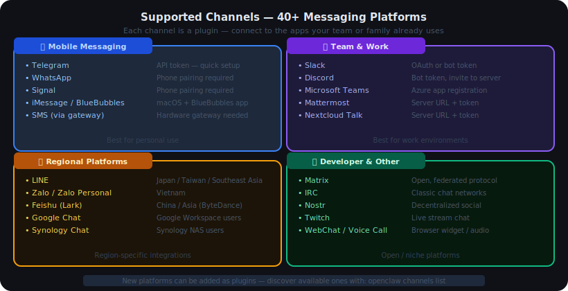
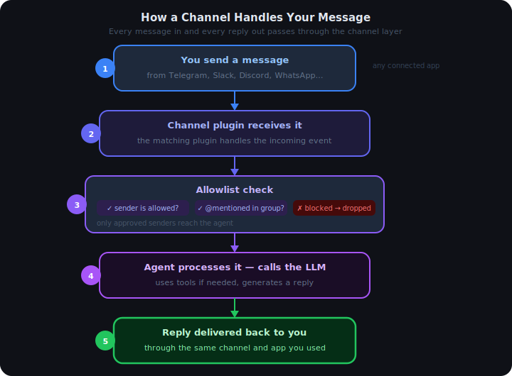
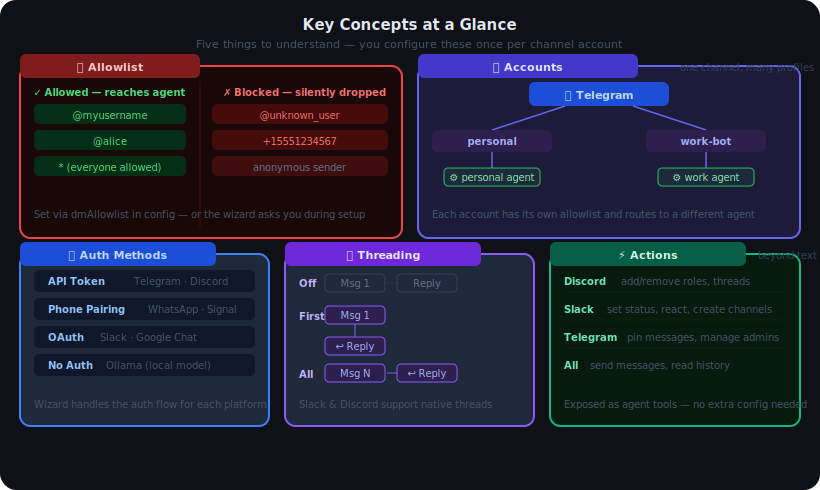

# 04 — Channels in OpenClaw

## Contents

1. [What is a Channel?](#1-what-is-a-channel)
2. [Which Channels Does OpenClaw Support?](#2-which-channels-does-openclaw-support)
3. [How a Channel Handles Your Message](#3-how-a-channel-handles-your-message)
4. [Key Concepts](#4-key-concepts)
   - 4.1 [Allowlist — Who Can Talk to the Agent](#41-allowlist--who-can-talk-to-the-agent)
   - 4.2 [Accounts — Multiple Profiles per Channel](#42-accounts--multiple-profiles-per-channel)
   - 4.3 [Auth Methods — How Platforms Verify You](#43-auth-methods--how-platforms-verify-you)
   - 4.4 [Threading — How Replies Are Structured](#44-threading--how-replies-are-structured)
   - 4.5 [Actions — What the Agent Can Do in a Channel](#45-actions--what-the-agent-can-do-in-a-channel)
5. [How to Connect a Channel](#5-how-to-connect-a-channel)
   - 5.1 [Way 1 — Wizard (Recommended)](#51-way-1--wizard-recommended)
   - 5.2 [Way 2 — Non-Interactive CLI](#52-way-2--non-interactive-cli)
   - 5.3 [Way 3 — Edit Config Directly](#53-way-3--edit-config-directly)
6. [How to Test If Your Channel Works](#6-how-to-test-if-your-channel-works)

---

## 1. What is a Channel?

A **channel** is a plugin that connects OpenClaw to a messaging platform. Each channel teaches OpenClaw how to talk to one specific app: how to receive messages from it, how to send replies back, and how to log in.

Think of it as an adapter. OpenClaw on one side, Telegram (or Slack, or Discord) on the other — the channel sits in the middle and handles all the translation between them.

| Without a channel | With a channel |
|---|---|
| OpenClaw has no way to receive messages | Messages arrive from any connected app |
| Agent has no way to send replies | Replies go back to the same app automatically |
| You'd need a separate interface for each app | One agent, many apps — no extra work |

Every messaging platform works differently. Telegram uses polling. Discord uses WebSockets. WhatsApp requires a paired phone. The channel layer handles all of that — your agent never needs to know which platform it is on.

---

## 2. Which Channels Does OpenClaw Support?

OpenClaw supports **40+ messaging platforms** grouped into four categories:



| Category | Platforms |
|---|---|
| **Mobile Messaging** | Telegram, WhatsApp, Signal, iMessage/BlueBubbles, SMS |
| **Team & Work** | Slack, Discord, Microsoft Teams, Mattermost, Nextcloud Talk |
| **Regional** | LINE, Zalo, Feishu (Lark), Google Chat, Synology Chat |
| **Developer & Other** | Matrix, IRC, Nostr, Twitch, WebChat, Voice Call |

You can connect more than one channel at the same time — for example, Telegram for personal use and Slack for work, both routing to the same agent.

---

## 3. How a Channel Handles Your Message

Every message you send follows the same path through the channel layer:



| Step | What happens |
|---|---|
| 1 — You send | A message arrives from your connected app |
| 2 — Channel receives | The matching channel plugin picks up the event |
| 3 — Allowlist check | Confirms you are allowed to talk to the agent |
| 4 — Agent processes | Agent reads the message, calls the LLM, may use tools |
| 5 — Reply delivered | Channel plugin sends the reply back to you in the same app |

---

## 4. Key Concepts



### 4.1 Allowlist — Who Can Talk to the Agent

The **allowlist** controls who is allowed to trigger the agent. Any message from a sender not on the list is silently ignored.

You configure this per channel account — by username, user ID, phone number, or `*` to allow everyone.

```
Examples:
  dmAllowlist: "@myusername"        ← only you
  dmAllowlist: "@alice,@bob"        ← you and two others
  dmAllowlist: "*"                  ← everyone (public bot)
```

In group chats, you can also require the agent to be **@mentioned** before it responds — so it stays quiet in busy conversations unless someone calls on it directly.

> **Why this matters:** Without an allowlist, anyone who knows your channel account can send messages to your agent. For personal use, set it to your own username only.

---

### 4.2 Accounts — Multiple Profiles per Channel

One channel platform can have **multiple accounts**. For example, you might run two separate Telegram bots — one for personal use and one for a project. Each account is configured independently with its own allowlist, agent binding, and settings.

```
Channel: Telegram
  Account: personal   → routes to "personal" agent
  Account: work-bot   → routes to "work" agent
```

Each account goes through a lifecycle: configured → authenticated → running → connected (receiving live events).

---

### 4.3 Auth Methods — How Platforms Verify You

Different platforms use different ways to prove you have permission to run a bot:

| Auth method | How it works | Examples |
|---|---|---|
| **API token** | You get a token from the platform's developer portal | Telegram, Discord, Slack |
| **Phone pairing** | You scan a QR code or enter a code to link your phone | WhatsApp, Signal |
| **OAuth** | You log in through the platform's website | Slack, Google Chat |
| **No auth** | Local model, no key needed | Ollama, local LiteLLM |

The wizard (`openclaw channels add`) walks you through the correct auth flow for whichever platform you choose. You do not need to know the details in advance.

Some platforms like WhatsApp use an **approval-code flow** for new users: an unknown person who messages the bot receives a one-time code. You approve them from your end, and they are added to the allowlist.

---

### 4.4 Threading — How Replies Are Structured

**Threading** controls whether the agent's reply attaches directly to your message or starts a new conversation thread.

| Mode | What it does |
|---|---|
| **Off** | Sends a plain new message — no reply-to attachment |
| **First** | Always replies to the first message in the conversation |
| **All** | Replies to the most recent message |

On platforms with native threads (Slack, Discord), the agent can also route replies into the correct thread automatically — keeping long conversations tidy.

---

### 4.5 Actions — What the Agent Can Do in a Channel

Beyond sending text replies, some channels expose richer **actions** the agent can take automatically:

| Platform | Available actions |
|---|---|
| **Discord** | Create threads, add/remove roles, update bot presence |
| **Slack** | Set status, react to messages, create channels |
| **Telegram** | Pin messages, promote admins, manage group members |

These are exposed as tools the agent can call — you do not need to configure anything extra for them to work once the channel is connected.

---

## 5. How to Connect a Channel

### 5.1 Way 1 — Wizard (Recommended)

The interactive wizard is the easiest path. It asks you one question at a time and handles the authentication flow for you.

```bash
openclaw channels add
```

The wizard will:
1. Ask which platform you want to connect
2. Walk you through the platform's auth (token, QR code, or OAuth)
3. Ask for an account name (optional, for display purposes)
4. Ask which agent should receive messages from this channel
5. Write everything to your config automatically

**Good for:** first-time setup, unfamiliar platforms.

---

### 5.2 Way 2 — Non-Interactive CLI

If you already know the platform and have credentials ready, skip the wizard with flags:

```bash
openclaw channels add \
  --channel telegram \
  --account personal \
  --dm-allowlist "@myusername"
```

| Flag | What it sets |
|---|---|
| `--channel` | Platform ID — e.g. `telegram`, `slack`, `discord` |
| `--account` | Account name / ID for this profile |
| `--dm-allowlist` | Who can DM the agent (usernames, `*` for all) |
| `--group-channels` | Which group chats the agent listens in |

**Good for:** scripting, automation, repeatable deployments.

---

### 5.3 Way 3 — Edit Config Directly

You can edit `openclaw.json` directly to add or adjust a channel. This gives you full control over every option.

The channel configuration lives under the channel's key inside the config. Here is a Telegram example:

```json
"telegram": {
  "accounts": {
    "personal": {
      "token": "TELEGRAM_BOT_TOKEN",
      "dmAllowlist": ["@myusername"],
      "threading": "all"
    }
  }
}
```

> **Tip:** The actual bot token value should be stored as an environment variable or in `.env`, not written directly in the config. Use the variable name (e.g. `TELEGRAM_BOT_TOKEN`) and set the real value in your environment.

**Good for:** fine-tuning options the wizard does not expose, managing many accounts.

---

## 6. How to Test If Your Channel Works

**Step 1 — List configured channels:**

```bash
openclaw channels list
```

Shows every channel and account OpenClaw knows about. If your channel appears here, it is at least configured — even if not yet connected.

---

**Step 2 — Check connection status:**

```bash
openclaw channels status
```

Shows whether each channel account is connected, when it last received a message, and any errors (expired session, missing permissions, wrong token, etc.).

| Status shown | What it means |
|---|---|
| Connected | Channel is live and receiving messages |
| Configured | Set up but not yet authenticated / started |
| Error: expired | Session expired — re-run wizard to re-authenticate |
| Error: permissions | Bot is missing required permissions in the platform |

---

**Step 3 — Run a full health check:**

```bash
openclaw doctor
```

Scans the full setup — gateway, config, auth, channels, and models — and shows fix hints for any problem found.

---

**Step 4 — Send a real test message:**

Send a message from your connected app (e.g., Telegram) to your bot and wait for a reply. If the agent responds, the full chain (Channel → Agent → LLM → Channel) is working end-to-end.

| What you see | What it means |
|---|---|
| You get a reply | Channel, Agent, and LLM are all working |
| No reply, no error | Check allowlist — your username may not be on it |
| "Bot is not responding" | Run `openclaw channels status` to check connection |
| 401 / Unauthorized error | Token is wrong or expired — reconnect the channel |
