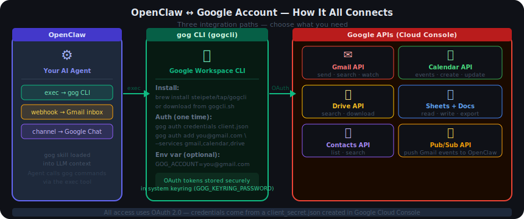
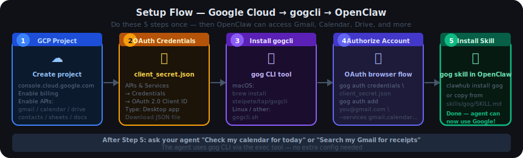

# 05.1 — Google Cloud Setup

> Enable your OpenClaw agent to access Gmail, Calendar, Drive, Contacts, Sheets, Docs, and Google Chat.

## Contents

1. [How It Works — Overview](#1-how-it-works--overview)
2. [What You Can Do After Setup](#2-what-you-can-do-after-setup)
3. [Part A — Google Workspace Access (Gmail, Calendar, Drive…)](#3-part-a--google-workspace-access-gmail-calendar-drive)
   - 3.1 [Step 1 — Create a Google Cloud Project](#31-step-1--create-a-google-cloud-project)
   - 3.2 [Step 2 — Enable the APIs You Need](#32-step-2--enable-the-apis-you-need)
   - 3.3 [Step 3 — Create OAuth Credentials](#33-step-3--create-oauth-credentials)
   - 3.4 [Step 4 — Install gogcli](#34-step-4--install-gogcli)
   - 3.5 [Step 5 — Authorize Your Google Account](#35-step-5--authorize-your-google-account)
   - 3.6 [Step 6 — Install the gog Skill in OpenClaw](#36-step-6--install-the-gog-skill-in-openclaw)
   - 3.7 [Test — Ask Your Agent About Your Google Account](#37-test--ask-your-agent-about-your-google-account)
4. [Part B — Gmail Inbox Triggers (Optional)](#4-part-b--gmail-inbox-triggers-optional)
5. [Part C — Google Chat Channel (Optional)](#5-part-c--google-chat-channel-optional)
6. [Reference — All gog Commands](#6-reference--all-gog-commands)
7. [Troubleshooting](#7-troubleshooting)

---

## 1. How It Works — Overview



OpenClaw connects to your Google account through three separate integration paths. You only need to set up the ones you want:

| Path | What it gives you | Required for |
|---|---|---|
| **Part A — gogcli** | Read and write Gmail, Calendar, Drive, Contacts, Sheets, Docs | Most users — start here |
| **Part B — Gmail Pub/Sub** | Agent wakes up when a new email arrives in your inbox | Reactive automation |
| **Part C — Google Chat** | Use Google Chat as the messaging channel to talk to the bot | Google Workspace teams |

**Part A is the foundation.** Parts B and C are independent add-ons.

---

## 2. What You Can Do After Setup

Once Part A is complete, your agent gains access to:

| Service | What the agent can do |
|---|---|
| **Gmail** | Search emails, send mail, reply to threads, create drafts, monitor inbox |
| **Calendar** | List events, create events, update events, show colour-coded schedule |
| **Drive** | Search files, find documents by topic or date |
| **Contacts** | Look up names, email addresses, phone numbers |
| **Sheets** | Read cell ranges, write/update values, append rows, clear ranges |
| **Docs** | Export document content as text, read the contents of a doc |

**Example prompts that work after setup:**

- "What meetings do I have this week?"
- "Search my Gmail for receipts from Amazon in the last 30 days"
- "Send an email to alex@example.com saying I will be 10 minutes late"
- "Check if John Smith is in my contacts and get his email"
- "Read cells A1:D10 from my expense tracker spreadsheet"

---

## 3. Part A — Google Workspace Access (Gmail, Calendar, Drive…)



**What you need:**
- A Google account (personal Gmail or Google Workspace)
- A browser (to authorise in Google Cloud Console)
- 20 minutes

---

### 3.1 Step 1 — Create a Google Cloud Project

A Google Cloud project is a container for your API credentials. You need one even if you are not running anything on Google Cloud.

**Via browser (easiest):**

1. Go to [console.cloud.google.com](https://console.cloud.google.com)
2. Click the project selector at the top → **New Project**
3. Name it something memorable (e.g., `openclaw-personal`)
4. Click **Create**
5. Make sure your new project is selected in the top bar

**Via terminal (gcloud CLI):**

```bash
gcloud projects create openclaw-personal --name="OpenClaw Personal"
gcloud config set project openclaw-personal
```

> **Billing note:** You do not need to enable billing for the APIs used by gogcli (Gmail, Calendar, Drive, Contacts, Sheets, Docs are all free quota). Only enable billing if you plan to run a VM on this project.

---

### 3.2 Step 2 — Enable the APIs You Need

Enable the Google APIs that match the services you want to use. You can always come back and enable more later.

**Via browser:**

1. Go to **APIs & Services → Library** in the Cloud Console
2. Search for and enable each API you need (click the API name → **Enable**):

| API name to search for | Service it enables |
|---|---|
| `Gmail API` | Send and read email |
| `Google Calendar API` | Read and write calendar events |
| `Google Drive API` | Search and access files |
| `People API` | Access Contacts |
| `Google Sheets API` | Read and write spreadsheets |
| `Google Docs API` | Read documents |

**Via terminal (enable all at once):**

```bash
gcloud services enable \
  gmail.googleapis.com \
  calendar-json.googleapis.com \
  drive.googleapis.com \
  people.googleapis.com \
  sheets.googleapis.com \
  docs.googleapis.com
```

---

### 3.3 Step 3 — Create OAuth Credentials

This creates the `client_secret.json` file that `gog` uses to identify your application to Google.

1. In the Cloud Console, go to **APIs & Services → Credentials**
2. Click **+ Create Credentials** → **OAuth client ID**
3. If prompted, click **Configure Consent Screen** first:
   - Choose **External** (for personal Gmail) or **Internal** (for Google Workspace)
   - Fill in: App name (e.g., `OpenClaw`), user support email, developer email
   - Click **Save and Continue** through the remaining screens — defaults are fine
   - Scopes and test users can be left empty
4. Back on **Create OAuth client ID**:
   - **Application type:** Select **Desktop app**
   - **Name:** `openclaw-gog` (or anything)
   - Click **Create**
5. A dialog shows your client ID and secret — click **Download JSON**
6. Save the file somewhere safe, e.g., `~/.openclaw/google-client-secret.json`

> **Keep this file private.** Anyone with it can request access to Google accounts on your behalf (they would still need the user to approve it in a browser, but keep it safe anyway).

---

### 3.4 Step 4 — Install gogcli

`gog` (gogcli) is the command-line tool that handles all Google API calls. OpenClaw calls it via the `exec` tool.

**macOS (Homebrew):**

```bash
brew install steipete/tap/gogcli
```

**Linux / other:**

Download the binary from [gogcli.sh](https://gogcli.sh) and place it on your `$PATH`.

**Verify:**

```bash
gog --version
```

---

### 3.5 Step 5 — Authorize Your Google Account

This is the one-time OAuth flow. A browser will open and ask you to sign in to your Google account and grant access. Tokens are stored securely in your system keyring.

```bash
# Tell gog where to find your OAuth client secret
gog auth credentials ~/.openclaw/google-client-secret.json

# Authorize your Google account (opens a browser window)
gog auth add you@gmail.com \
  --services gmail,calendar,drive,contacts,sheets,docs
```

After the browser flow, verify it worked:

```bash
gog auth list
```

You should see your account listed with a green status.

**If you are running on a remote server (no browser):**

```bash
gog auth add you@gmail.com \
  --services gmail,calendar,drive,contacts,sheets,docs \
  --no-browser
```

This prints a URL — open it on any machine with a browser, complete the auth, and paste the callback URL or code back into the terminal.

**Environment variable (optional):**

Set this once so you never have to pass `--account` to every command:

```bash
export GOG_ACCOUNT=you@gmail.com
```

Add it to your `~/.bashrc` or `~/.zshrc` to make it permanent.

**Keyring password (server environments):**

On servers without a GUI keyring, `gog` falls back to an encrypted file. Set a password:

```bash
export GOG_KEYRING_PASSWORD=your-strong-password
```

This is the `GOG_KEYRING_PASSWORD` you also see in the GCP Docker setup.

---

### 3.6 Step 6 — Install the gog Skill in OpenClaw

The `gog` skill is a `SKILL.md` file that teaches the LLM what `gog` can do and how to use it. Without this, the agent has the `exec` tool available but does not know the right commands to run.

**Option 1 — Install from ClawHub (recommended):**

```bash
# Install the ClawHub CLI if you do not have it
npm i -g clawhub

# Install the gog skill
clawhub install gog
```

**Option 2 — Copy from the built-in skills folder:**

The skill is already included in OpenClaw's `skills/gog/` folder. Copy it to your workspace:

```bash
cp -r /path/to/openclaw/skills/gog ~/.openclaw/workspace/skills/gog
```

Or symlink it (easier to keep in sync):

```bash
ln -s /path/to/openclaw/skills/gog ~/.openclaw/workspace/skills/gog
```

**Verify the skill is loaded:**

```bash
clawhub list
# or
openclaw skills list
```

Start a new agent session — the skill is picked up automatically.

---

### 3.7 Test — Ask Your Agent About Your Google Account

Start your agent and try these:

```
You: What meetings do I have today?
Bot: [lists today's calendar events]

You: Search my Gmail for emails from GitHub in the last week
Bot: [returns matching threads]

You: Send an email to test@example.com with subject "Hello" and body "This is a test"
Bot: [confirms before sending, then sends]
```

If the agent responds with "I don't have access to your Google account" or similar, check that:
1. `gog auth list` shows your account as authorized
2. The `gog` skill is loaded (`clawhub list`)
3. The `exec` tool is enabled in your OpenClaw config (`group:runtime` or profile `coding` or `full`)

---

## 4. Part B — Gmail Inbox Triggers (Optional)

This makes the agent **wake up automatically** when a new email arrives. Useful for building email-based automations — e.g., "summarise every email and send me a WhatsApp".

**How it works:**

```
New email arrives in Gmail
      ↓
Gmail pushes a notification to a Google Pub/Sub topic
      ↓
gogcli's watch server receives it
      ↓
Triggers OpenClaw via a webhook
      ↓
Agent reads and processes the email
      ↓
Sends a summary to your chosen channel
```

**Additional requirements:**

- `gcloud` CLI installed and logged in
- `tailscale` installed (recommended; for other tunnels see the docs)
- OpenClaw webhooks enabled

---

### Wizard (recommended — handles everything automatically)

```bash
openclaw webhooks gmail setup --account you@gmail.com
```

This wizard:
1. Installs `gcloud`, `gogcli`, and `tailscale` (on macOS via brew)
2. Creates a Pub/Sub topic in your GCP project
3. Grants Gmail the permission to publish to it
4. Configures OpenClaw webhooks
5. Starts the push handler via `gog gmail watch serve`

---

### Manual setup

If you prefer to do it step by step:

**1. Enable APIs:**

```bash
gcloud services enable gmail.googleapis.com pubsub.googleapis.com
```

**2. Create a Pub/Sub topic:**

```bash
gcloud pubsub topics create gog-gmail-watch
```

**3. Grant Gmail permission to publish to the topic:**

```bash
gcloud pubsub topics add-iam-policy-binding gog-gmail-watch \
  --member=serviceAccount:gmail-api-push@system.gserviceaccount.com \
  --role=roles/pubsub.publisher
```

**4. Start watching your inbox:**

```bash
gog gmail watch start \
  --account you@gmail.com \
  --label INBOX \
  --topic projects/<your-project-id>/topics/gog-gmail-watch
```

**5. Enable webhooks in `openclaw.json`:**

```json
"hooks": {
  "enabled": true,
  "token": "OPENCLAW_HOOK_TOKEN",
  "path": "/hooks",
  "presets": ["gmail"]
}
```

**6. Start the push handler:**

```bash
openclaw webhooks gmail run
```

Or start it automatically with the gateway — add `hooks.gmail.account` to your config and the gateway will manage it.

---

### Config — deliver summaries to a channel

```json
"hooks": {
  "enabled": true,
  "token": "OPENCLAW_HOOK_TOKEN",
  "presets": ["gmail"],
  "mappings": [
    {
      "match": { "path": "gmail" },
      "action": "agent",
      "wakeMode": "now",
      "messageTemplate": "New email from {{messages[0].from}}\nSubject: {{messages[0].subject}}\n{{messages[0].body}}",
      "deliver": true,
      "channel": "last"
    }
  ]
}
```

`channel: "last"` delivers to whichever channel you last used (Slack, WhatsApp, Teams, etc.).

---

## 5. Part C — Google Chat Channel (Optional)

This makes OpenClaw available as a bot **inside Google Chat** — your team can message the bot directly in Chat spaces or DMs.

**How it works:** Google Chat sends HTTPS POST requests to OpenClaw's `/googlechat` endpoint whenever a user messages the bot.

**Additional requirements:**

- A public HTTPS URL for your OpenClaw gateway (Tailscale Funnel, ngrok, Caddy, or Cloudflare Tunnel)

---

### Step 1 — Enable the Google Chat API and create a Service Account

1. Go to [console.cloud.google.com/apis/api/chat.googleapis.com/credentials](https://console.cloud.google.com/apis/api/chat.googleapis.com/credentials)
2. Enable the **Google Chat API** if not already enabled
3. Click **Create Credentials** → **Service Account**
   - Name: `openclaw-chat`
   - Permissions: leave blank → Continue → Done
4. Click the service account you just created → **Keys** tab
5. **Add Key** → **Create new key** → **JSON** → **Create**
6. Save the downloaded file, e.g., `~/.openclaw/googlechat-service-account.json`

---

### Step 2 — Configure the Chat App

1. Go to [console.cloud.google.com/apis/api/chat.googleapis.com/hangouts-chat](https://console.cloud.google.com/apis/api/chat.googleapis.com/hangouts-chat)
2. Fill in **Application info**:
   - **App name**: `OpenClaw`
   - **Avatar URL**: leave blank or use your own image
   - **Description**: `Personal AI Assistant`
3. Enable **Interactive features**
4. Under **Functionality**, check **Join spaces and group conversations**
5. Under **Connection settings**, select **HTTP endpoint URL**
6. Under **Triggers**, select **Use a common HTTP endpoint URL** and enter:
   ```
   https://your-public-url/googlechat
   ```
   Run `openclaw status` to find your public URL.
7. Under **Visibility**, check **Make this Chat app available to specific people** and enter your email
8. Click **Save**
9. After saving, refresh the page → set **App status** to **Live - available to users** → Save

---

### Step 3 — Configure OpenClaw

```json
"channels": {
  "googlechat": {
    "enabled": true,
    "serviceAccountFile": "~/.openclaw/googlechat-service-account.json",
    "audienceType": "app-url",
    "audience": "https://your-public-url/googlechat",
    "webhookPath": "/googlechat"
  }
}
```

Restart the gateway:

```bash
openclaw gateway restart
```

---

### Step 4 — Add the Bot to Google Chat

1. Go to [chat.google.com](https://chat.google.com)
2. Click **+** next to **Direct Messages**
3. Search for your bot's app name (e.g., `OpenClaw`)
4. Click **Add** or **Chat** → send "Hello"

---

## 6. Reference — All gog Commands

Once set up, the agent uses these `gog` commands via the `exec` tool. You can also run them manually to test.

### Gmail

```bash
# Search emails (by thread)
gog gmail search 'newer_than:7d from:github.com' --max 10

# Search messages (individual emails, ignores threading)
gog gmail messages search 'in:inbox' --max 20

# Send email
gog gmail send --to alex@example.com --subject "Hello" --body "Hi there"

# Send multi-line email (recommended for longer messages)
gog gmail send --to alex@example.com --subject "Update" --body-file ./message.txt

# Send HTML email
gog gmail send --to alex@example.com --subject "Report" \
  --body-html "<p>See attached report.</p>"

# Create a draft
gog gmail drafts create --to alex@example.com --subject "Draft" --body-file ./draft.txt

# Reply to a thread
gog gmail send --to alex@example.com --subject "Re: Hello" \
  --body "Thanks!" --reply-to-message-id <msgId>
```

### Calendar

```bash
# List events
gog calendar events primary --from 2025-03-21T00:00:00Z --to 2025-03-28T00:00:00Z

# Create an event
gog calendar create primary \
  --summary "Team meeting" \
  --from 2025-03-25T10:00:00Z \
  --to 2025-03-25T11:00:00Z

# Update an event
gog calendar update primary <eventId> --summary "New title" --event-color 9

# Show available event colours
gog calendar colors
```

### Drive

```bash
# Search files
gog drive search "budget 2025" --max 10

# Search within a specific folder
gog drive search "kind:spreadsheet" --max 20
```

### Contacts

```bash
# List contacts
gog contacts list --max 20

# Search contacts
gog contacts list --max 5 --json | grep "alex"
```

### Sheets

```bash
# Read a range
gog sheets get <sheetId> "Sheet1!A1:D10" --json

# Write values
gog sheets update <sheetId> "Sheet1!A1:B2" \
  --values-json '[["Name","Score"],["Alice","95"]]' --input USER_ENTERED

# Append a row
gog sheets append <sheetId> "Sheet1!A:C" \
  --values-json '[["2025-03-21","Lunch","12.50"]]' --insert INSERT_ROWS

# Clear a range
gog sheets clear <sheetId> "Sheet1!A2:Z100"

# Get sheet metadata
gog sheets metadata <sheetId> --json
```

### Docs

```bash
# Read a document
gog docs cat <docId>

# Export as plain text
gog docs export <docId> --format txt --out /tmp/doc.txt
```

---

## 7. Troubleshooting

| What you see | What to check |
|---|---|
| `gog: command not found` | gogcli is not installed or not on `$PATH` — re-run the install step |
| `gog auth list` shows no accounts | Run `gog auth add you@gmail.com --services gmail,...` again |
| `Error 403: access denied` on a specific API | That API is not enabled — go back to Step 2 and enable it |
| `OAuth consent screen not configured` | Go to APIs & Services → OAuth Consent Screen and complete the form |
| Agent says "I cannot access your Google account" | The `gog` skill is not loaded — run `clawhub list` and check it appears |
| Agent has the skill but never calls `gog` | `exec` tool is not enabled — add `group:runtime` to your tool config |
| `redirect_uri_mismatch` during auth | You chose the wrong application type in Step 3 — must be **Desktop app** |
| `Token has been expired or revoked` | Re-run `gog auth add you@gmail.com --services ...` to refresh tokens |
| Gmail Pub/Sub: `Invalid topicName` | Project mismatch — topic must be in the same project as your OAuth client |
| Gmail Pub/Sub: `User not authorized` | IAM binding missing — re-run the `add-iam-policy-binding` command |
| Google Chat: `405 Method Not Allowed` | The `googlechat` channel is not configured or the gateway needs a restart |
| Google Chat: bot not found in Chat search | App visibility may not include your email — check the visibility settings |
