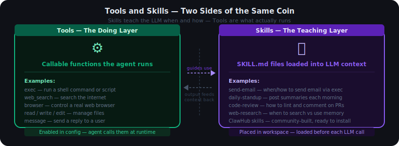
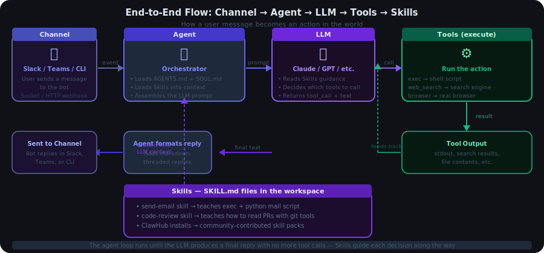
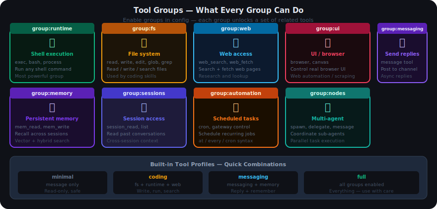
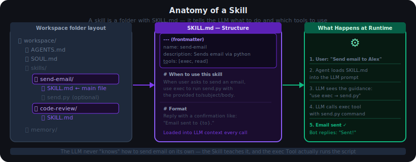
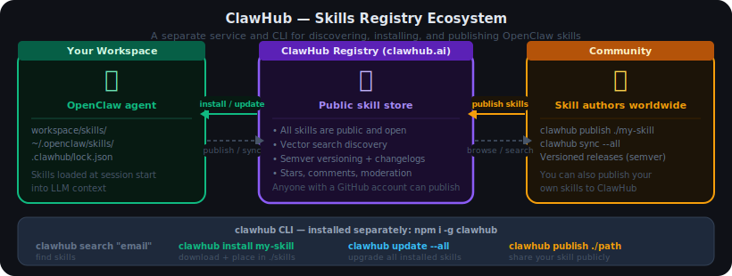

# 05 — Tools and Skills

## Contents

1. [What Are Tools and Skills?](#1-what-are-tools-and-skills)
   - 1.1 [The Full Picture — End-to-End Flow](#11-the-full-picture--end-to-end-flow)
   - 1.2 [Tools vs Skills — The Key Difference](#12-tools-vs-skills--the-key-difference)
2. [Tools — Deep Dive](#2-tools--deep-dive)
   - 2.1 [Tool Groups](#21-tool-groups)
   - 2.2 [Key Tools Explained](#22-key-tools-explained)
   - 2.3 [Tool Profiles](#23-tool-profiles)
   - 2.4 [Exec Approvals — Safety Gate](#24-exec-approvals--safety-gate)
3. [Skills — Deep Dive](#3-skills--deep-dive)
   - 3.1 [Anatomy of a Skill](#31-anatomy-of-a-skill)
   - 3.2 [Where Skills Live](#32-where-skills-live)
   - 3.3 [ClawHub — Community Skills Marketplace](#33-clawhub--community-skills-marketplace)
   - 3.4 [Skills Config — Fine-Grained Control](#34-skills-config--fine-grained-control)
4. [Concrete Examples — How Things Get Done](#4-concrete-examples--how-things-get-done)
5. [Simple Setup](#5-simple-setup)
   - 5.1 [Enable Tools](#51-enable-tools)
   - 5.2 [Add a Skill](#52-add-a-skill)
   - 5.3 [Install from ClawHub](#53-install-from-clawhub)

---

## 1. What Are Tools and Skills?

OpenClaw does more than answer questions — it can run code, search the web, write files, send messages, and automate workflows. Two concepts make this possible: **Tools** and **Skills**.



| | Tools | Skills |
|---|---|---|
| **What it is** | Callable functions the agent runs | SKILL.md files loaded into the LLM's context |
| **Role** | The "doing" layer — actually executes things | The "teaching" layer — tells the LLM when and how |
| **Where defined** | Built into OpenClaw, enabled via config | Files in your workspace's `skills/` folder |
| **Examples** | `exec`, `web_search`, `browser`, `read` | `send-email`, `code-review`, `daily-standup` |
| **Runs at** | Runtime — called by the LLM during the loop | Prompt assembly time — loaded before the LLM call |

> **Simple analogy:** Tools are the hands. Skills are the instruction manual for the hands. The LLM reads the manual, then decides which hand to use.

---

### 1.1 The Full Picture — End-to-End Flow

Here is what happens, step by step, from the moment a user sends a message to the moment the bot replies:



**Step-by-step:**

1. **User sends a message** in Slack, Teams, or the CLI
2. **The Channel receives the event** and hands it to the Agent
3. **The Agent assembles the prompt** — it loads identity files (AGENTS.md, SOUL.md) and injects all active Skills into the LLM context
4. **The LLM decides** what to do — it reads the Skills, picks a plan, and either responds directly or calls a Tool
5. **The Tool executes** — for example, `exec` runs a shell script, `web_search` hits a search engine, `browser` opens a real browser window
6. **The result comes back** to the LLM — it reads the output and either calls another tool or writes a final reply
7. **The Agent formats and sends the reply** back to the Channel

This loop repeats until the LLM produces a final response with no more tool calls.

---

### 1.2 Tools vs Skills — The Key Difference

The clearest way to understand the difference:

- **Without a Tool**, the LLM cannot actually do anything in the real world — no matter how capable it is, it can only produce text.
- **Without a Skill**, the LLM still has the tool available but may not know the right way to use it for your specific situation.

**Example — sending an email:**

| Step | Tools alone | Tools + a send-email Skill |
|---|---|---|
| LLM has `exec` | Can run shell commands | Can run shell commands |
| LLM knows your setup | No — guesses | Yes — Skill explains which script to call, what arguments to pass |
| Result | Inconsistent | Reliable, matches your environment |

---

## 2. Tools — Deep Dive

### 2.1 Tool Groups

Tools are organized into **groups**. You enable groups in your config — OpenClaw then makes all tools in that group available to the agent.



| Group | Tools it includes | What it enables |
|---|---|---|
| `group:runtime` | `exec`, `bash`, `process` | Run shell commands, scripts, programs |
| `group:fs` | `read`, `write`, `edit`, `glob`, `grep` | Read and modify files on disk |
| `group:web` | `web_search`, `web_fetch` | Search the internet and fetch web pages |
| `group:ui` | `browser`, `canvas` | Control a real browser; interact with web UIs |
| `group:messaging` | `message` | Send replies back to a channel asynchronously |
| `group:memory` | `mem_read`, `mem_write` | Store and recall information across sessions |
| `group:sessions` | `session_read`, `session_list` | Access past conversation sessions |
| `group:automation` | `cron`, `gateway` | Schedule recurring jobs; control the gateway |
| `group:nodes` | `spawn`, `delegate` | Spawn sub-agents for parallel tasks |

---

### 2.2 Key Tools Explained

**`exec` — the most powerful tool**

Runs any shell command or script on the host machine (or inside a sandbox if enabled). This is how the agent writes code and runs it, installs packages, sends emails via scripts, generates reports — essentially anything a shell can do.

```
Example: exec("python send_email.py --to alex@example.com --subject 'Hello'")
```

Exec is gated by an **approval file** (see Section 2.4) — commands must be pre-approved before they can run.

---

**`web_search` and `web_fetch`**

`web_search` queries a search engine and returns a list of results. `web_fetch` fetches the full content of a specific URL. Together they let the agent research topics, check documentation, or monitor pages.

---

**`browser`**

Controls a real Chromium browser using Playwright. The agent can navigate pages, click buttons, fill in forms, take screenshots, and extract text. Useful for web automation, scraping, or interacting with tools that have no API.

---

**`read` / `write` / `edit`**

File system tools. `read` loads a file's contents, `write` creates or overwrites a file, `edit` makes targeted changes (like `sed`). These are the foundation of any coding or document-management workflow.

---

**`message`**

Sends a message back to the current channel at any point during the agent loop — before the final reply. Used for progress updates: "Fetching the report now…" followed by the actual result.

---

**`mem_read` / `mem_write`**

Reads from and writes to the agent's persistent memory store. The memory system uses vector search — the agent can store facts, preferences, and summaries, and retrieve relevant ones based on semantic similarity even across different sessions.

---

### 2.3 Tool Profiles

Rather than enabling every group individually, OpenClaw provides **profiles** — named presets that combine groups:

| Profile | Groups included | Best for |
|---|---|---|
| `minimal` | `messaging` only | Q&A bots that only reply |
| `coding` | `fs` + `runtime` + `web` | Developer assistants |
| `messaging` | `messaging` + `memory` | Support bots that remember users |
| `full` | All groups | Fully autonomous agents |

Set the profile in your config:

```json
"tools": {
  "profile": "coding"
}
```

Or enable groups individually to mix and match:

```json
"tools": {
  "groups": ["group:runtime", "group:fs", "group:web"]
}
```

---

### 2.4 Exec Approvals — Safety Gate

Because `exec` runs real shell commands, OpenClaw requires each distinct command pattern to be **pre-approved** before it runs. Approvals live in:

```
~/.openclaw/exec-approvals.json
```

When the agent tries to run a command that has not been approved, it pauses and asks the user. Once you approve, it is added to the file and will run automatically in the future.

This prevents an agent from accidentally (or maliciously) running destructive commands. You can also pre-populate `exec-approvals.json` with a known safe list for your environment.

---

## 3. Skills — Deep Dive

### 3.1 Anatomy of a Skill

A **Skill** is a folder containing at minimum one file: `SKILL.md`.



The `SKILL.md` file has two parts:

**Frontmatter** — machine-readable metadata:

```yaml
---
name: send-email
description: Sends an email via a Python script using SMTP
tools: [exec, read]
---
```

**Body** — free text instructions for the LLM:

```markdown
# When to use this skill
When the user asks you to send an email, use this skill.

# How to do it
Run the send.py script in this folder:
  exec("python skills/send-email/send.py --to {to} --subject {subject} --body {body}")

# Format
Reply with: "Email sent to {to}."
```

The body is plain English. You write it however is clearest for the LLM to follow.

---

### 3.2 Where Skills Live

Skills can come from several locations. OpenClaw loads them in this order:

| Location | Path | Notes |
|---|---|---|
| **Workspace skills** | `{workspace}/skills/` | Agent-specific skills — loaded first |
| **Global skills** | `~/.openclaw/skills/` | Available to all agents |
| **Channel-specific** | `{workspace}/skills/{channel}/` | Only active for a specific channel |
| **Installed via ClawHub CLI** | `clawhub install <slug>` | Downloaded into `./skills` — see Section 3.3 |

> **Tip:** Skills in the workspace folder override global skills with the same name. You can customise a community skill by copying it to your workspace folder and editing it.

---

### 3.3 ClawHub — Community Skills Marketplace



**ClawHub** ([clawhub.ai](https://clawhub.ai)) is the **public skill registry for OpenClaw**. It is a free service — all skills are public, open, and visible to everyone. Community-built skills cover common tasks: code review, standup summaries, GitHub notifications, database backups, CRM updates, and more.

> **Important:** ClawHub has its **own separate CLI** — it is not part of the `openclaw` command. You install it once with npm, then use the `clawhub` command independently.

**Install the ClawHub CLI first:**

```bash
npm i -g clawhub
```

---

**Daily use — find and install skills:**

```bash
# Search by plain English (powered by vector search)
clawhub search "send email"
clawhub search "postgres backup"

# Install a skill — downloads it into ./skills in your workspace
clawhub install send-email
clawhub install daily-standup --version 1.2.0   # pin a specific version

# List what you have installed
clawhub list

# Update a single skill or everything at once
clawhub update send-email
clawhub update --all
```

Installed skills land in `./skills` under your current workdir (or the configured OpenClaw workspace). They are picked up automatically at the next agent session start.

---

**Publishing your own skills:**

Anyone with a GitHub account (at least one week old) can publish to ClawHub. This is also a great way to back up your own skills.

```bash
# Log in (browser flow)
clawhub login
clawhub whoami

# Publish a single skill folder
clawhub publish ./skills/my-skill --slug my-skill --name "My Skill" --version 1.0.0 --changelog "Initial release"

# Batch sync — scans your workspace and publishes new/updated skills
clawhub sync
clawhub sync --all          # no prompts
clawhub sync --dry-run      # preview without uploading
```

---

**What ClawHub provides:**

| Feature | Details |
|---|---|
| **Discovery** | Vector search (semantic, not just keyword) + tags |
| **Versioning** | Semver — `install --version`, `update --version`, tags like `latest` |
| **Lock file** | `.clawhub/lock.json` tracks every installed skill and its version |
| **Stars & comments** | Community feedback per skill |
| **Moderation** | Skills with 3+ unique reports are auto-hidden; moderators can review |
| **Open** | All skills and their `SKILL.md` content are publicly browsable |

---

**Lock file and reproducibility:**

When you install skills, ClawHub writes a lock file at `.clawhub/lock.json`. This records the exact version of each installed skill, so a team member running `clawhub install` from the same repo gets the same skill versions you have.

---

**Telemetry note:**

`clawhub sync` (when logged in) sends a minimal install-count snapshot. Disable it:

```bash
export CLAWHUB_DISABLE_TELEMETRY=1
```

---

### 3.4 Skills Config — Fine-Grained Control

You can control which skills are active and configure their behaviour in `openclaw.json`:

```json
"skills": {
  "paths": ["./skills", "~/.openclaw/skills"],
  "enabled": ["send-email", "code-review"],
  "disabled": ["web-research"],
  "gate": "auto"
}
```

| Config field | What it does |
|---|---|
| `paths` | Folders to scan for skills |
| `enabled` | Whitelist — only these skills load (leave empty to load all) |
| `disabled` | Blacklist — these skills never load |
| `gate` | `"auto"` (load relevant skills) or `"all"` (load every skill always) |

> **Token budget:** Each SKILL.md is injected into the LLM prompt. Loading many large skills increases token cost per request. Use `enabled` to keep only what is needed.

---

## 4. Concrete Examples — How Things Get Done

These are real scenarios showing how Channel, Agent, LLM, Tools, and Skills all work together.

---

**Scenario A — "Run the tests and tell me if they pass"**

| Step | What happens |
|---|---|
| Channel | User types the message in Slack |
| Agent | Loads `code-review` skill (if present), assembles prompt |
| LLM | Decides to use `exec` to run `npm test` |
| Tool | `exec("npm test")` runs in the project directory |
| Result | stdout/stderr returned to LLM |
| LLM | Reads output, writes summary |
| Channel | Bot replies "All 42 tests passed." |

Groups needed: `group:runtime`

---

**Scenario B — "Search for the latest news about OpenAI and summarise it"**

| Step | What happens |
|---|---|
| Channel | User asks in Teams |
| LLM | Calls `web_search("OpenAI news 2025")` |
| Tool | Returns top 5 search results |
| LLM | Calls `web_fetch` on the most relevant link |
| Tool | Returns the article text |
| LLM | Summarises and replies |
| Channel | Bot posts the summary |

Groups needed: `group:web`

---

**Scenario C — "Send a daily standup summary every morning at 9am"**

| Step | What happens |
|---|---|
| Skill | `daily-standup` skill is installed |
| Config | Cron job: `every day at 09:00` → trigger this agent |
| Morning | Cron fires, agent session starts |
| LLM | Reads the standup skill, gathers yesterday's session notes via `session_read` |
| LLM | Calls `message` to post the summary to `#standup` channel |
| Channel | Standup appears in Slack automatically |

Groups needed: `group:sessions`, `group:messaging`, `group:automation`

---

**Scenario D — "Fill in the expense form on the company portal"**

| Step | What happens |
|---|---|
| Skill | `expense-form` skill is installed, describes the portal flow |
| LLM | Calls `browser` tool to open the portal URL |
| Tool | Chromium opens; agent navigates the page |
| LLM | Fills in the form fields using browser clicks |
| Tool | Form submitted successfully |
| Channel | Bot replies "Expense submitted." |

Groups needed: `group:ui`

---

## 5. Simple Setup

### 5.1 Enable Tools

**Way 1 — Use a built-in profile (recommended for most users):**

```json
"tools": {
  "profile": "coding"
}
```

**Way 2 — Enable specific groups:**

```json
"tools": {
  "groups": ["group:runtime", "group:fs", "group:web"]
}
```

**Way 3 — Wizard:**

```bash
openclaw tools configure
```

The wizard walks you through each group and asks whether to enable it.

---

### 5.2 Add a Skill

Create a folder under your workspace's `skills/` directory and add a `SKILL.md` file:

```
workspace/
  skills/
    send-email/
      SKILL.md
      send.py       ← optional helper script
```

Minimal `SKILL.md`:

```markdown
---
name: send-email
description: Sends an email when the user asks
tools: [exec]
---

When the user asks to send an email, run:
  exec("python skills/send-email/send.py --to {to} --subject {subject} --body {body}")

Reply with: "Email sent to {to}."
```

The skill is loaded automatically the next time the agent starts. No restart needed if the watcher is enabled.

---

### 5.3 Install from ClawHub

ClawHub uses its own CLI — install it once, then use `clawhub` commands:

```bash
# 1. Install the ClawHub CLI (one time)
npm i -g clawhub

# 2. Search for a skill
clawhub search "standup"

# 3. Install it (lands in ./skills/)
clawhub install daily-standup

# 4. Check what is installed
clawhub list
```

Once installed, the skill is picked up at the next agent session start. To restrict a skill to a single agent, ensure you run `clawhub install` from inside that agent's workspace directory. To make a skill available to all agents, copy it to `~/.openclaw/skills/`.

---

**Troubleshooting:**

| What you see | What to check |
|---|---|
| Agent replies but never runs any tool | Is the right tool group enabled in config? |
| `exec` is blocked / waiting for approval | Check `~/.openclaw/exec-approvals.json` — approve the command |
| Skill is installed but agent ignores it | Check `skills.enabled` list — is the skill whitelisted? |
| Too many tokens / slow responses | Too many large skills loaded — use `skills.enabled` to trim |
| `clawhub install` fails | Is the ClawHub CLI installed? Run `npm i -g clawhub` first. Confirm the slug with `clawhub search` |
| Tool runs but result is wrong | Edit the SKILL.md instructions to be more specific about arguments and format |
