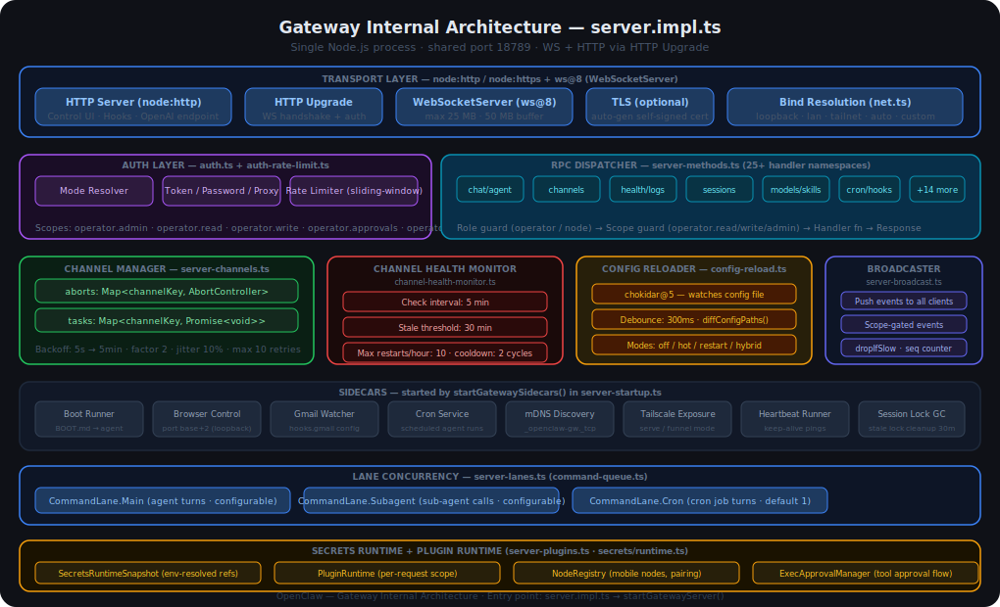
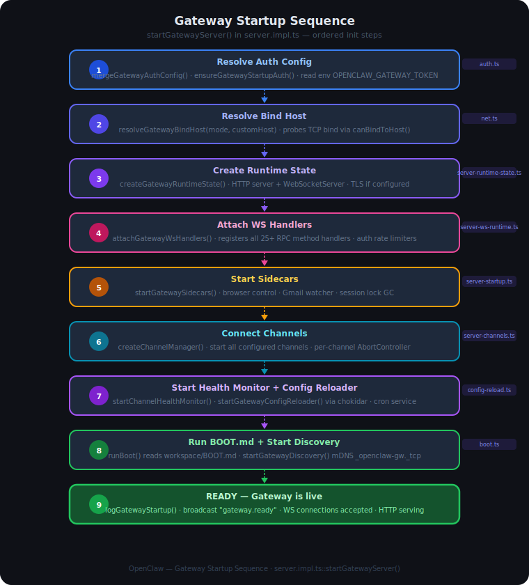
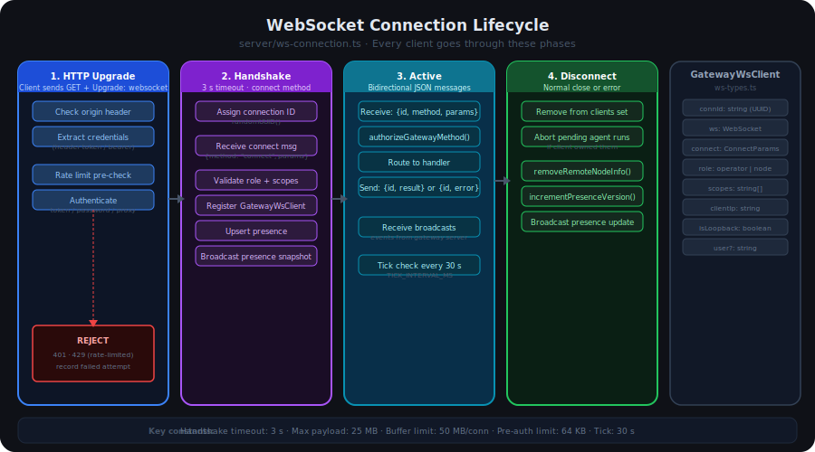
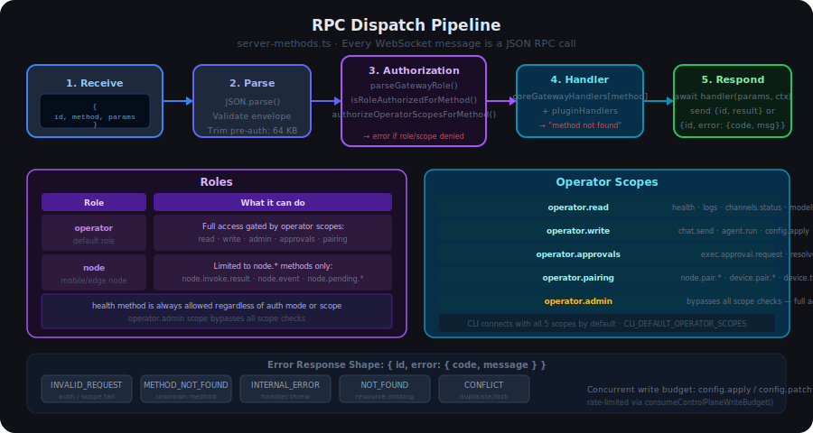
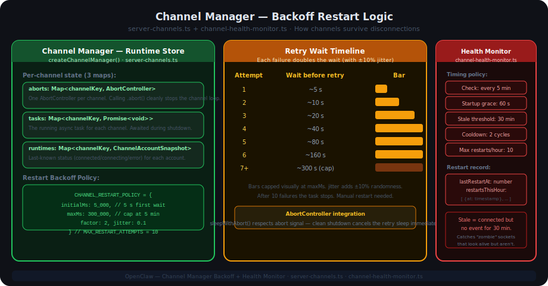

# 06.1 Gateway — Technical Deep Dive

> **Companion to [06_Gateway.md](06_Gateway.md).**
> This document is for readers who want to understand the internal wiring — the source files, libraries, data structures, and control flows that make the Gateway work.

---

## Table of Contents

1. [Basic Knowledge — Must Read First](#1-basic-knowledge--must-read-first)
2. [Technical Architecture](#2-technical-architecture)
3. [Libraries and Main Technical Components](#3-libraries-and-main-technical-components)
4. [Meaning of Each Component](#4-meaning-of-each-component)
5. [How Components Work Together](#5-how-components-work-together)
6. [Most Important Components](#6-most-important-components)
7. [Logic of the Most Important Components](#7-logic-of-the-most-important-components)

---

## 1. Basic Knowledge — Must Read First

Before diving into Gateway internals, you need to be comfortable with six foundational ideas. If you already know them, skip ahead.

### 1.1 TypeScript + Node.js Server

The Gateway is a **TypeScript** program running on **Node.js**. It is a long-lived server process — not a script that runs and exits. It listens for network connections 24/7.

```
Node.js process
└── Event loop (single thread, non-blocking I/O)
    ├── HTTP server listening on port 18789
    ├── WebSocket server (same port, HTTP Upgrade)
    └── Background timers (health checks, config reload, cron)
```

Key idea: Node.js is **single-threaded** but handles many clients at the same time using asynchronous I/O and Promises.

---

### 1.2 HTTP vs WebSocket

| | HTTP | WebSocket |
|---|---|---|
| Connection | Short-lived (open → send → close) | Persistent (stays open) |
| Direction | Client pulls, server responds | Both sides can send at any time |
| Use case | REST API, file download | Real-time events, streaming |
| How it starts | Normal TCP | HTTP `Upgrade` header |

The Gateway uses **both on the same port**:
- HTTP for REST endpoints (health, Control UI, hooks, OpenAI proxy)
- WebSocket for all RPC traffic (CLI, agents, node devices)

When a client sends `GET /` with header `Upgrade: websocket`, Node.js upgrades the TCP connection to a WebSocket. After that, HTTP is no longer involved.

---

### 1.3 JSON-RPC — Remote Procedure Call over WebSocket

Every message the CLI or an agent sends to the Gateway is a **JSON-RPC** call:

```json
// Request (client → gateway)
{ "id": "abc123", "method": "chat.send", "params": { "message": "hello" } }

// Success response (gateway → client)
{ "id": "abc123", "result": { "ok": true } }

// Error response (gateway → client)
{ "id": "abc123", "error": { "code": "INVALID_REQUEST", "message": "not authorized" } }
```

The `method` string is the name of the operation. The `id` field ties every request to its response, even when many calls are in-flight at the same time. This pattern is called **JSON-RPC** and is similar to calling a function over the network.

---

### 1.4 The `ws` Library

Node.js has no built-in WebSocket server. The Gateway uses the **`ws`** npm library (version 8) to:
- Accept WebSocket upgrade requests
- Send and receive binary/text frames
- Detect disconnections via ping/pong

```typescript
import { WebSocketServer, WebSocket } from 'ws';

const wss = new WebSocketServer({ server: httpServer });
wss.on('connection', (socket) => {
  socket.on('message', (data) => { /* handle JSON-RPC */ });
  socket.send(JSON.stringify({ result: 'ok' }));
});
```

---

### 1.5 AbortController — Clean Shutdown Signal

`AbortController` is a browser/Node.js API for cancelling async operations. The Gateway creates **one AbortController per channel**. When a channel needs to stop:

```typescript
const ac = new AbortController();

// Long-running operation that respects the signal
await sleepWithAbort(5000, ac.signal); // waits 5s, or exits immediately if aborted

// Somewhere else: cancel everything
ac.abort(); // the sleep above exits instantly
```

Think of it as a "kill switch" that can reach deep into nested async code.

---

### 1.6 Exponential Backoff — Smart Retry

When a channel disconnects, the Gateway does not immediately reconnect — that would spam the remote server. Instead it waits, and doubles the wait time on each failure:

```
Attempt 1 → wait  5 s → retry
Attempt 2 → wait 10 s → retry
Attempt 3 → wait 20 s → retry
Attempt 4 → wait 40 s → retry
...
Attempt 7+ → wait 300 s (5 min, maximum)
```

A small ±10% **jitter** is added to each wait so that multiple channels do not all retry at the exact same moment (the "thundering herd" problem).

---

## 2. Technical Architecture

The diagram below shows every major subsystem inside the Gateway process and how they connect.



### Reading the diagram

- **Left column** — the network transport layer: HTTP and WebSocket share one port
- **Centre** — the runtime core: auth, RPC dispatch, channels, broadcaster, and sidecars
- **Right column** — background services that run independently: health monitor, config reloader, cron

Data flows from left to right when a client connects, and from right to left when the Gateway pushes events back.

### Source file map

| Subsystem | Source file |
|---|---|
| Entry point / orchestrator | `src/gateway/server.impl.ts` |
| HTTP server + Control UI | `src/gateway/server-http.ts` |
| WebSocket handler setup | `src/gateway/server-ws-runtime.ts` |
| Per-connection lifecycle | `src/gateway/server/ws-connection.ts` |
| RPC method registry | `src/gateway/server-methods.ts` |
| Auth + rate limiting | `src/gateway/auth.ts`, `auth-rate-limit.ts` |
| Channel manager | `src/gateway/server-channels.ts` |
| Channel health monitor | `src/gateway/channel-health-monitor.ts` |
| Config reload | `src/gateway/config-reload.ts` |
| Broadcaster | `src/gateway/server-broadcast.ts` |
| Concurrency lanes | `src/gateway/server-lanes.ts` |
| Sidecar services | `src/gateway/server-startup.ts` |
| Runtime constants | `src/gateway/server-constants.ts` |
| Bind host resolution | `src/gateway/net.ts` |

---

## 3. Libraries and Main Technical Components

### 3.1 External Libraries

| Library | Version | Purpose |
|---|---|---|
| `ws` | 8 | WebSocket server and client |
| `chokidar` | 5 | File system watcher for config hot-reload |
| `node:http` / `node:https` | built-in | HTTP server (shared port with WS) |
| `node:crypto` | built-in | Token generation, UUID |
| `node:net` | built-in | TCP bind probing for bind-host resolution |

### 3.2 Main Technical Components

```
┌─────────────────────────────────────────────────────┐
│                 Gateway Process                     │
│                                                     │
│  ┌──────────────┐   ┌──────────────────────────┐   │
│  │  HTTP Server │   │   WebSocket Server (ws)  │   │
│  │  (node:http) │   │   same TCP port          │   │
│  └──────────────┘   └──────────────────────────┘   │
│          │                      │                   │
│  ┌───────▼──────────────────────▼────────────────┐  │
│  │              Auth Layer                       │  │
│  │   auth.ts + auth-rate-limit.ts                │  │
│  └───────────────────┬───────────────────────────┘  │
│                      │                              │
│  ┌───────────────────▼───────────────────────────┐  │
│  │              RPC Dispatcher                   │  │
│  │   server-methods.ts (25+ handlers)            │  │
│  └───────────────────┬───────────────────────────┘  │
│                      │                              │
│  ┌───────────────────▼───────────────────────────┐  │
│  │              Broadcaster                      │  │
│  │   server-broadcast.ts                        │  │
│  └───────────────────────────────────────────────┘  │
│                                                     │
│  ┌──────────────┐  ┌──────────────┐  ┌──────────┐  │
│  │  Channel Mgr │  │Health Monitor│  │  Config  │  │
│  │ server-      │  │ channel-     │  │  Reload  │  │
│  │ channels.ts  │  │ health-      │  │  config- │  │
│  │              │  │ monitor.ts   │  │  reload  │  │
│  └──────────────┘  └──────────────┘  └──────────┘  │
└─────────────────────────────────────────────────────┘
```

---

## 4. Meaning of Each Component

### 4.1 HTTP Server (`server-http.ts`)

Serves non-WebSocket traffic on the same port (18789):

| Path | Purpose |
|---|---|
| `GET /health` | Health check — returns `{ status: "ok" }` |
| `GET /` | Control UI (web dashboard) |
| `POST /api/hook/*` | Incoming webhook triggers |
| `POST /v1/chat/completions` | OpenAI-compatible proxy endpoint |
| `GET /canvas/*` | Canvas data endpoint |

The HTTP server is also the **parent** of the WebSocket server — when a WebSocket upgrade comes in, Node.js passes it from HTTP to the `ws.WebSocketServer`.

---

### 4.2 WebSocket Connection Handler (`ws-connection.ts`)

Every WebSocket client goes through a lifecycle managed by `attachGatewayWsConnectionHandler()`. Each connected client is represented as a `GatewayWsClient` object:

```typescript
interface GatewayWsClient {
  connId: string;         // UUID assigned at connect
  ws: WebSocket;          // the raw socket
  connect: ConnectParams; // client-provided metadata
  role: 'operator' | 'node'; // authorized role
  scopes: string[];       // operator.read, operator.write, etc.
  clientIp: string;       // remote IP address
  isLoopback: boolean;    // true if connecting from localhost
  user?: string;          // optional username
}
```

This object is passed to every RPC handler so handlers know *who* is calling.

---

### 4.3 Auth Layer (`auth.ts` + `auth-rate-limit.ts`)

Two-stage authentication:

**Stage 1 — Transport auth** (at HTTP upgrade time):
- Reads credentials from headers (`Authorization: Bearer <token>` or `x-openclaw-token`)
- Supports four modes: `none`, `token`, `password`, `trusted-proxy`
- On failure: closes with HTTP 401 or 429

**Stage 2 — Rate limiter** (`auth-rate-limit.ts`):
- Sliding-window counter per `{scope, clientIp}`
- Scopes: `shared-secret`, `device-token`, `hook-auth`
- Loopback addresses are exempt by default
- Window pruned every 60 seconds

---

### 4.4 RPC Dispatcher (`server-methods.ts`)

The core routing table. All 25+ method handlers are merged into one registry:

```typescript
const coreGatewayHandlers = {
  ...chatHandlers,
  ...agentHandlers,
  ...configHandlers,
  ...cronHandlers,
  ...channelHandlers,
  ...logHandlers,
  // ... and more
};
```

Before routing to a handler, `authorizeGatewayMethod()` checks:
1. The client's **role** (`operator` vs `node`)
2. The client's **scopes** (e.g., `operator.write` is required for `chat.send`)

---

### 4.5 Broadcaster (`server-broadcast.ts`)

Pushes events to all connected clients (or a filtered subset). Created by `createGatewayBroadcaster()`.

Key features:
- **Scope gating**: `exec.approval` events are only sent to clients with `APPROVALS_SCOPE`
- **Sequence counter**: every broadcast gets an auto-incrementing `seq` number so clients can detect missed messages
- **`dropIfSlow`**: if a client's WebSocket send buffer is full, the message is dropped rather than blocking the server

---

### 4.6 Channel Manager (`server-channels.ts`)

Manages persistent connections **from** the Gateway **to** external systems (e.g., Slack, email, Discord). Uses three Maps as its runtime store:

```typescript
const aborts  = new Map<channelKey, AbortController>();
const tasks   = new Map<channelKey, Promise<void>>();
const runtimes = new Map<channelKey, ChannelAccountSnapshot>();
```

- **`aborts`** — one AbortController per channel; calling `.abort()` stops that channel's loop
- **`tasks`** — the running async promise for each channel; awaited during shutdown
- **`runtimes`** — last-known status (connected/connecting/error) for UI display

---

### 4.7 Channel Health Monitor (`channel-health-monitor.ts`)

A background watcher that detects broken channels that didn't self-heal:

| Setting | Value |
|---|---|
| Check interval | every 5 minutes |
| Startup grace period | 60 seconds (ignores failures during boot) |
| Stale threshold | 30 minutes without an event = "zombie" |
| Cooldown | 2 check cycles after a restart before checking again |
| Max restarts per hour | 10 |

"Zombie" detection: a channel that reports `connected` status but has not produced any event for 30 minutes is considered stale and restarted.

---

### 4.8 Config Reloader (`config-reload.ts`)

Watches the config file using `chokidar` and applies changes without requiring a full server restart:

| Mode | Behaviour |
|---|---|
| `off` | Changes ignored until manual restart |
| `hot` | Applies safe changes immediately (channels, models, scopes) |
| `restart` | Full process restart on any change |
| `hybrid` (default) | Hot-reload safe changes; full restart for structural changes |

`diffConfigPaths()` computes which config keys changed. A 300ms debounce prevents multiple rapid file saves from triggering multiple reloads.

---

### 4.9 Concurrency Lanes (`server-lanes.ts`)

Controls how many operations can run in parallel. Three lanes:

| Lane | Default | Controls |
|---|---|---|
| `Main` | configurable | Primary agent runs, chat |
| `Subagent` | configurable | Sub-agent invocations |
| `Cron` | configurable | Scheduled task execution |

`applyGatewayLaneConcurrency()` reads the `GatewayConfig` and sets each lane's semaphore limit.

---

### 4.10 Sidecar Services (`server-startup.ts`)

Small background processes started alongside the main server:

- **Browser controller** — controls Chromium for browser automation tasks
- **Gmail watcher** — polls Gmail for incoming messages to trigger agents
- **Session lock GC** — garbage-collects stale session locks that weren't released

---

## 5. How Components Work Together

### 5.1 Startup Sequence

The 9-step startup sequence shows how all components are assembled in order:



Each step must succeed before the next begins. If step 3 (Create Runtime State) fails (e.g., port already in use), the process exits and never reaches step 4.

The key ordering principle: **security before functionality**. Auth is resolved first (step 1), the port is claimed second (step 3), handlers are registered third (step 4), and only then are external connections made (steps 5–6).

---

### 5.2 Client Connection Flow

When the CLI runs `openclaw chat`:

```
CLI                    Gateway
 │                        │
 ├── GET ws://...:18789 ──►│  HTTP Upgrade
 │                        │  → check origin
 │                        │  → rate limit check
 │                        │  → authenticate token
 │                        │
 ├── {method:"connect"} ──►│  Handshake (3s timeout)
 │                        │  → assign connId UUID
 │                        │  → validate role+scopes
 │                        │  → register GatewayWsClient
 │◄── {result:{connId}} ──┤  → broadcast presence
 │                        │
 ├── {id:1,method:"chat.send",params:{...}} ──►│
 │                        │  → authorizeGatewayMethod()
 │                        │  → route to chatHandlers
 │◄── {id:1,result:{...}} ──┤
```

---

### 5.3 WebSocket Connection Lifecycle



The four phases:
1. **HTTP Upgrade** — authentication before the socket is opened
2. **Handshake** — role and scope negotiation (3-second timeout)
3. **Active** — normal bidirectional message exchange
4. **Disconnect** — cleanup: remove from client set, abort pending runs, broadcast presence update

---

### 5.4 RPC Dispatch Pipeline

Every WebSocket message (after handshake) goes through this 5-step pipeline:



The pipeline is **fail-fast**: any step can return an error response and short-circuit the rest. A message that fails at step 3 (Authorization) never reaches step 4 (Handler lookup).

---

### 5.5 Channel Lifecycle

Channels run independently from client connections. A channel for Slack, for example:

```
Gateway starts
    │
    ├── createChannelManager()
    │     └── for each configured channel:
    │           ├── new AbortController()
    │           ├── store in aborts Map
    │           └── launch runChannelLoop(key, signal)
    │
runChannelLoop:
    ├── attempt = 0
    ├── LOOP:
    │     ├── connect to Slack API
    │     ├── if success → stream events to Gateway
    │     ├── if error/disconnect:
    │     │     ├── attempt++
    │     │     ├── if attempt > 10 → STOP (manual restart needed)
    │     │     ├── wait = min(5000 * 2^attempt * jitter, 300000)
    │     │     └── sleepWithAbort(wait, signal) → retry
    │     └── if signal.aborted → clean exit
```

---

## 6. Most Important Components

In order of criticality to the Gateway's core function:

| Rank | Component | Why critical |
|---|---|---|
| 1 | **RPC Dispatcher** | Every operation in the system routes through it |
| 2 | **Auth Layer** | All security enforcement lives here |
| 3 | **Channel Manager** | Controls all external integrations (Slack, email, etc.) |
| 4 | **WebSocket Connection Handler** | Manages every connected client's state |
| 5 | **Broadcaster** | The only way the Gateway pushes events to clients |

The **Config Reloader** and **Health Monitor** are important for production stability but are not in the critical path for basic operation.

---

## 7. Logic of the Most Important Components

### 7.1 RPC Dispatch — Step by Step


```
1. RECEIVE
   Raw WebSocket frame arrives as a string.

2. PARSE
   JSON.parse() → validate shape: must have id, method, params.
   Pre-auth messages are capped at 64 KB (MAX_PREAUTH_PAYLOAD_BYTES).
   Post-auth messages up to 25 MB (MAX_PAYLOAD_BYTES).

3. AUTHORIZATION
   parseGatewayRole(client) → 'operator' or 'node'

   If role is 'node':
     method must be in NODE_ROLE_METHODS set
     (node.invoke.result, node.event, node.pending.*)
     else → INVALID_REQUEST error

   If role is 'operator':
     requiredScope = METHOD_SCOPE_GROUPS[method]
     if client.scopes includes 'operator.admin' → always allowed
     if client.scopes includes requiredScope → allowed
     else → INVALID_REQUEST error

4. HANDLER LOOKUP
   handler = coreGatewayHandlers[method] ?? pluginHandlers[method]
   if not found → METHOD_NOT_FOUND error

5. EXECUTE + RESPOND
   try {
     result = await handler(params, ctx)
     ws.send({ id, result })
   } catch (err) {
     ws.send({ id, error: { code: 'INTERNAL_ERROR', message: err.message } })
   }
```

**Concurrent write budget**: `config.apply`, `config.patch`, and `update.run` are additionally rate-limited via `consumeControlPlaneWriteBudget()` to prevent overlapping writes that could corrupt config state.

---

### 7.2 Channel Backoff and Health Monitor



#### Backoff calculation

```typescript
const CHANNEL_RESTART_POLICY = {
  initialMs: 5_000,   // 5 seconds on first failure
  maxMs: 300_000,     // cap at 5 minutes
  factor: 2,          // double each time
  jitter: 0.1,        // ±10% random variation
};

const MAX_RESTART_ATTEMPTS = 10;

function calcBackoffMs(attempt: number): number {
  const base = CHANNEL_RESTART_POLICY.initialMs
    * Math.pow(CHANNEL_RESTART_POLICY.factor, attempt - 1);
  const capped = Math.min(base, CHANNEL_RESTART_POLICY.maxMs);
  const jitter = 1 + (Math.random() * 2 - 1) * CHANNEL_RESTART_POLICY.jitter;
  return Math.floor(capped * jitter);
}

// attempt 1 → ~5 000 ms
// attempt 2 → ~10 000 ms
// attempt 3 → ~20 000 ms
// attempt 7 → ~300 000 ms (capped)
```

#### Health Monitor decision logic

```
Every 5 minutes, for each channel:

  if uptime < 60s → skip (startup grace)
  if cooldownCycles > 0 → cooldownCycles--; skip

  snapshot = runtimes.get(channelKey)

  if snapshot.status === 'error':
    → restart channel

  if snapshot.status === 'connected':
    age = now - snapshot.lastEventAt
    if age > 30 minutes:
      → restart channel (zombie detected)

  if restartsThisHour.length >= 10:
    → skip (rate limited)

  if restarting:
    restartsThisHour.push({ at: now })
    lastRestartAt = now
    cooldownCycles = 2
    abort existing channel loop
    start fresh channel loop
```

---

### 7.3 Auth Rate Limiter — Sliding Window

```typescript
// Conceptual model of the sliding-window limiter

interface Window {
  timestamps: number[];   // arrival time of each attempt
}

function isRateLimited(scope: string, ip: string): boolean {
  if (isLoopbackAddress(ip)) return false; // loopback always allowed

  const key = `${scope}:${ip}`;
  const window = store.get(key) ?? { timestamps: [] };
  const now = Date.now();
  const windowStart = now - WINDOW_MS;

  // Remove entries older than the window
  window.timestamps = window.timestamps.filter(t => t > windowStart);

  if (window.timestamps.length >= MAX_ATTEMPTS) {
    return true; // rate limited
  }

  window.timestamps.push(now);
  store.set(key, window);
  return false;
}

// Prune stale entries from store every 60 seconds
setInterval(() => {
  for (const [key, window] of store) {
    if (window.timestamps.length === 0) store.delete(key);
  }
}, 60_000);
```

Separate limits apply per scope:
- `shared-secret` — primary gateway token auth
- `device-token` — paired device authentication
- `hook-auth` — incoming webhook authentication

---

### 7.4 Config Reload — Hybrid Mode Logic

```
File system event detected (chokidar)
  │
  ├── debounce 300ms (ignore rapid saves)
  │
  ▼
Read new config from disk
diffConfigPaths(oldConfig, newConfig) → changed paths

For each changed path:

  ┌─────────────────────────────────────────────────────────┐
  │ HOT-RELOADABLE paths (apply immediately, no restart):   │
  │   channels.*, models.*, scopes.*, lanes.*               │
  └─────────────────────────────────────────────────────────┘
                            vs
  ┌─────────────────────────────────────────────────────────┐
  │ RESTART-REQUIRED paths (structural changes):            │
  │   auth.*, bindHost, port, tls.*, plugins.*              │
  └─────────────────────────────────────────────────────────┘

Hybrid mode decision:
  if any changed path is RESTART-REQUIRED:
    → schedule full process restart
  else if any changed path is HOT-RELOADABLE:
    → apply diff in memory:
        channels: stop removed channels, start new ones
        models: update model registry
        scopes: update operator scope sets
        lanes: call applyGatewayLaneConcurrency()
    → broadcast "gateway.config.updated" to all clients
```

This means you can add a new Slack channel or update a model alias without dropping any connected clients. But changing the auth token or port always requires a restart.

---

### 7.5 Key Runtime Constants

All timing and size limits are defined in `server-constants.ts`:

| Constant | Value | Effect |
|---|---|---|
| `MAX_PAYLOAD_BYTES` | 25 MB | Max WebSocket message size (post-auth) |
| `MAX_BUFFERED_BYTES` | 50 MB | Max per-connection send buffer before drop |
| `MAX_PREAUTH_PAYLOAD_BYTES` | 64 KB | Max message size before handshake completes |
| `DEFAULT_HANDSHAKE_TIMEOUT_MS` | 3 000 ms | Time allowed to complete `connect` handshake |
| `TICK_INTERVAL_MS` | 30 000 ms | Heartbeat check interval per active connection |
| `DEDUPE_TTL_MS` | 300 000 ms | How long to remember seen message IDs (5 min) |
| `DEDUPE_MAX` | 1 000 | Maximum deduplication cache entries |

---

## Summary

The Gateway's power comes from composing many small, focused components:

```
HTTP Server ─────────────────────────────────┐
WebSocket Server (ws) ──┐                    │
                        │                    │
                    Auth Layer               │
                        │                    │
                   RPC Dispatcher ──► Broadcaster ──► clients
                        │
          ┌─────────────┼──────────────┐
          │             │              │
    Channel Mgr   Config Reload   Sidecar Services
          │
    Health Monitor
```

Each component has a single responsibility. The Gateway itself is an **orchestrator** — `server.impl.ts` wires all the pieces together in the correct order and keeps them running for the life of the process.

---

*Source files: `src/gateway/` — OpenClaw Gateway*
