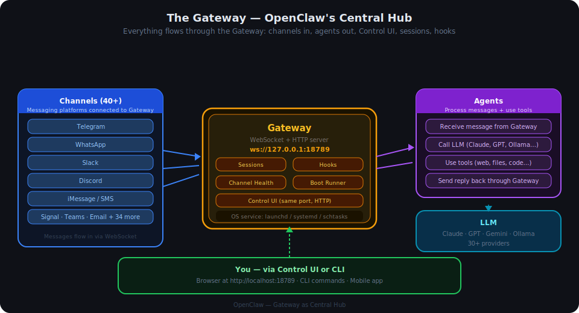
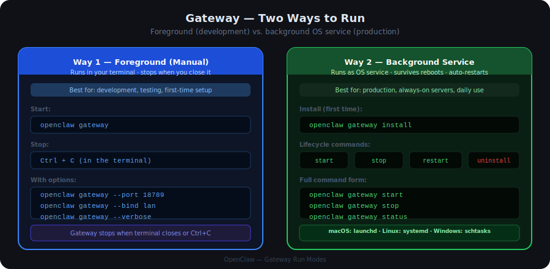
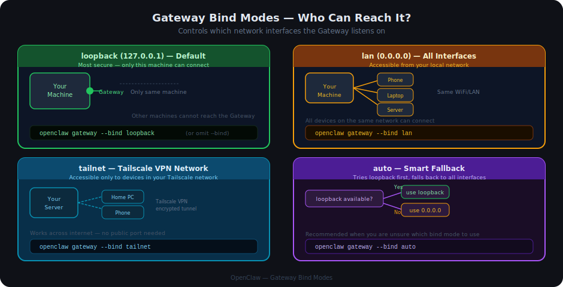
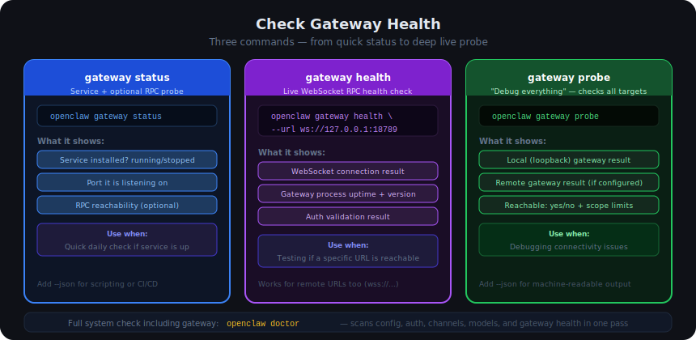

# 06 — The Gateway

## Contents

1. [What is the Gateway?](#1-what-is-the-gateway)
2. [Why the Gateway Matters](#2-why-the-gateway-matters)
3. [How the Gateway Works](#3-how-the-gateway-works)
4. [How to Start the Gateway](#4-how-to-start-the-gateway)
   - 4.1 [Way 1 — Foreground (Manual)](#41-way-1--foreground-manual)
   - 4.2 [Way 2 — Background Service (Recommended)](#42-way-2--background-service-recommended)
5. [How to Stop the Gateway](#5-how-to-stop-the-gateway)
6. [Configure the Gateway](#6-configure-the-gateway)
   - 6.1 [Port](#61-port)
   - 6.2 [Bind Mode — Who Can Reach It](#62-bind-mode--who-can-reach-it)
   - 6.3 [Authentication](#63-authentication)
7. [Check Gateway Health](#7-check-gateway-health)
8. [Troubleshooting](#8-troubleshooting)

---

## 1. What is the Gateway?

The **Gateway** is OpenClaw's server process. It is the single component that must be running for OpenClaw to work at all.

Think of it as the **control centre**: messages from all your messaging apps arrive here, agents are called from here, replies go back through here. Without the Gateway, nothing moves.

It is a **WebSocket + HTTP server** that runs on your machine (or a server you own) on port `18789` by default. It handles:

- Receiving messages from all connected channels (Telegram, Slack, WhatsApp, and 40+ others)
- Dispatching those messages to agents for processing
- Returning the agent's reply back to the originating channel
- Running a built-in Control UI (a web interface) at the same port
- Managing sessions, hooks, and boot automation
- Monitoring channel health and restarting stale connections automatically

The Gateway runs continuously in the background. You start it once and it stays running — either in your terminal or as an OS-managed background service.

---

## 2. Why the Gateway Matters

When you read about other OpenClaw components — LLMs, Agents, Channels — they all describe what OpenClaw *can do*. The Gateway is the component that actually *makes it run*.

| Without the Gateway | With the Gateway running |
|---|---|
| No messages are received | All channels are actively listening |
| No agent can respond | Agents process messages and reply |
| No Control UI is available | Web dashboard is live at localhost:18789 |
| Channels show "Configured" not "Connected" | Channels show "Connected" |
| `openclaw doctor` reports no gateway | All health checks pass |

**The Gateway is the prerequisite for everything else.** You configure LLMs, agents, and channels — but the Gateway is what holds them all together and keeps them running.

---

## 3. How the Gateway Works



When the Gateway starts, it:

1. **Binds a WebSocket listener** on the configured port (default `18789`) — this is also the "lock" that prevents two gateways running on the same port
2. **Starts the HTTP server** on the same port — serving the Control UI and any enabled API endpoints
3. **Connects all configured channels** — Telegram, Slack, WhatsApp, and others all open their connections
4. **Runs BOOT.md** — if a `BOOT.md` file exists in the workspace, the agent reads it and takes any defined startup actions (e.g. sending a startup message)
5. **Starts the channel health monitor** — periodically checks that channel connections are alive; silently reconnects stale ones

From that point on, every message from every channel flows through the Gateway to the appropriate agent, and every reply flows back through the same path.

| What the Gateway handles | What agents handle |
|---|---|
| Receiving messages from channels | Reading the message content |
| Authentication and session tracking | Deciding what to do (call LLM, use tools) |
| Routing messages to the right agent | Calling the LLM and using tools |
| Delivering replies back to channels | Generating the reply text |
| Channel reconnection on failures | Workspace operations (files, code) |
| Serving the Control UI | Executing skills |

---

## 4. How to Start the Gateway



There are two ways to run the Gateway. Choose based on your use case.

---

### 4.1 Way 1 — Foreground (Manual)

Runs in your terminal. Stops when you press `Ctrl+C` or close the terminal. Good for development, debugging, or first-time setup.

```bash
openclaw gateway
```

**With common options:**

```bash
# Specify a port
openclaw gateway --port 18789

# Bind to all network interfaces (accessible from LAN)
openclaw gateway --bind lan

# Verbose logs (shows channel events, agent calls, hook runs)
openclaw gateway --verbose

# Kill anything already holding the port, then start
openclaw gateway --force
```

**What you should see on startup:**

```
[gateway] binding ws://127.0.0.1:18789
[gateway] control-ui ready at http://127.0.0.1:18789
[channels] Telegram: connected
[channels] Slack: connected
[gateway] ready
```

---

### 4.2 Way 2 — Background Service (Recommended)

Installs the Gateway as an OS-managed service that starts automatically on login/boot, restarts if it crashes, and keeps running after you close the terminal.

**Step 1 — Install the service (first time only):**

```bash
openclaw gateway install
```

This registers the Gateway with your OS service manager:
- **macOS** → LaunchAgent at `~/Library/LaunchAgents/ai.openclaw.gateway.plist`
- **Linux** → systemd unit at `~/.config/systemd/user/openclaw-gateway.service`
- **Windows** → Task Scheduler task `ai.openclaw.gateway`

**Step 2 — Start it:**

```bash
openclaw gateway start
```

After this, the Gateway starts automatically on every login. You do not need to run it manually again.

**Check that it is running:**

```bash
openclaw gateway status
```

---

## 5. How to Stop the Gateway

**Foreground mode:** press `Ctrl+C` in the terminal where the Gateway is running.

**Background service:**

```bash
# Stop (service stays installed — restarts on next login)
openclaw gateway stop

# Restart (stop + start)
openclaw gateway restart

# Remove the service entirely (stop + unregister from OS)
openclaw gateway uninstall
```

| Command | What it does |
|---|---|
| `openclaw gateway stop` | Stops the running process; service is still installed and starts again on reboot |
| `openclaw gateway restart` | Stops then starts the service in one step — useful after config changes |
| `openclaw gateway uninstall` | Stops and removes the service registration; you would need to `gateway install` again to restore it |

> **Stopping vs Uninstalling:** `stop` keeps the service registered (it will restart on reboot). `uninstall` removes the service registration entirely. Use `stop` for temporary pauses, `uninstall` if you want to deregister it.

---

## 6. Configure the Gateway

Gateway settings live in the `gateway` section of `~/.openclaw/openclaw.json`.

```json
{
  "gateway": {
    "port": 18789,
    "bind": "loopback",
    "auth": {
      "mode": "token",
      "token": "OPENCLAW_GATEWAY_TOKEN"
    }
  }
}
```

---

### 6.1 Port

The Gateway listens on a single port that handles both WebSocket connections and the HTTP Control UI.

```json
"gateway": {
  "port": 18789
}
```

**Override without editing the config:**

```bash
openclaw gateway --port 18789
```

**Via environment variable:**

```bash
OPENCLAW_GATEWAY_PORT=18789 openclaw gateway
```

> **Default port:** `18789`. If you change the port, update any clients (the mobile app, remote setups) to match.

---

### 6.2 Bind Mode — Who Can Reach It

The bind mode controls which network interfaces the Gateway listens on — in other words, who can connect to it.



| Mode | Listens on | Who can connect | Use case |
|---|---|---|---|
| `loopback` | `127.0.0.1` | Only your machine | Default — most secure |
| `lan` | `0.0.0.0` | Anyone on the same WiFi/LAN | Home network, office |
| `tailnet` | Tailscale IP | Devices in your Tailscale VPN | Cross-internet, no public port |
| `auto` | Loopback if available, else `0.0.0.0` | Depends on resolution | Flexible fallback |
| `custom` | IP you specify | Depends on IP | Advanced setups |

```json
"gateway": {
  "bind": "loopback"
}
```

**Override at startup:**

```bash
openclaw gateway --bind lan
openclaw gateway --bind tailnet
```

> **Security note:** `loopback` is the default because it is the safest — nothing outside your machine can reach the Gateway. If you change to `lan`, make sure you also configure authentication (see below).

---

### 6.3 Authentication

When the Gateway is accessible from outside loopback, you should protect it with authentication.

| Mode | How it works | Use case |
|---|---|---|
| `token` | Shared secret token — clients must present it on connect | Default; good for single-user and scripts |
| `password` | Password checked on connect | Teams or multi-user setups |
| `trusted-proxy` | Identity passed by a reverse proxy (Nginx, Caddy, Pomerium) | Enterprise deployments |
| `none` | No auth — any connection accepted | Loopback-only; never use with LAN/public |

**Token auth (default):**

```json
"gateway": {
  "auth": {
    "mode": "token",
    "token": "OPENCLAW_GATEWAY_TOKEN"
  }
}
```

Set the token value in your environment:

```bash
export OPENCLAW_GATEWAY_TOKEN=your-secret-token-here
```

**Password auth:**

```json
"gateway": {
  "auth": {
    "mode": "password",
    "password": "OPENCLAW_GATEWAY_PASSWORD"
  }
}
```

Or pass it at startup (less secure — visible in process list):

```bash
openclaw gateway --auth password --password-file /path/to/password.txt
```

---

## 7. Check Gateway Health



Three commands cover different levels of verification:

### `gateway status` — Is the service running?

```bash
openclaw gateway status
```

Shows whether the OS service is installed and running. Quick and lightweight — does not open a WebSocket connection.

```bash
# JSON output for scripting or CI
openclaw gateway status --json

# Fail the command if the RPC probe also fails (useful in automation)
openclaw gateway status --require-rpc
```

---

### `gateway health` — Is the WebSocket endpoint responding?

```bash
openclaw gateway health --url ws://127.0.0.1:18789
```

Opens a real WebSocket connection to the Gateway and calls the health RPC. Confirms the Gateway process is alive and accepting connections — not just that the OS service entry exists.

---

### `gateway probe` — Debug everything

```bash
openclaw gateway probe
```

The most thorough check. Probes both the local (loopback) gateway and any configured remote gateway simultaneously. Prints reachability, RPC status, and auth scope for each.

```bash
# Machine-readable output
openclaw gateway probe --json

# Probe a remote gateway over SSH tunnel
openclaw gateway probe --ssh user@my-server.example.com
```

**Reading the output:**

| What you see | What it means |
|---|---|
| `Reachable: yes, RPC: ok` | Gateway is fully healthy |
| `Reachable: yes, RPC: limited` | Connected but missing an operator scope — check token/auth config |
| `Reachable: no` | Nothing is listening on that address |

---

### `openclaw doctor` — Full system check

```bash
openclaw doctor
```

Runs a full scan of your entire setup: config files, auth profiles, LLM providers, channels, and gateway health — all at once. The best starting point when something is wrong and you are not sure where.

---

## 8. Troubleshooting

| What you see | What to check |
|---|---|
| `Address already in use (EADDRINUSE)` | Another gateway (or another process) is already on port 18789. Use `--force` to kill it, or choose a different port with `--port` |
| `gateway status` shows service not installed | Run `openclaw gateway install` first |
| `gateway status` shows stopped | Run `openclaw gateway start` |
| Channels show "Configured" but not "Connected" | The Gateway is not running — start it |
| `Reachable: no` in `gateway probe` | Gateway is not running, or the bind mode/port does not match what the client expects |
| `RPC: limited - missing scope` | Token or password is wrong — check `OPENCLAW_GATEWAY_TOKEN` matches the value in config |
| Gateway starts but exits immediately | Check the logs: `openclaw gateway --verbose` — often a config parse error |
| Control UI not loading in browser | Confirm the Gateway is running, then try `http://127.0.0.1:18789` (not `https`) |
| macOS: service not starting after reboot | Check launchd with `launchctl list \| grep openclaw`; reinstall with `gateway uninstall` then `gateway install` |
| Linux: service not starting after reboot | Check systemd with `systemctl --user status openclaw-gateway`; check logs with `journalctl --user -u openclaw-gateway` |
